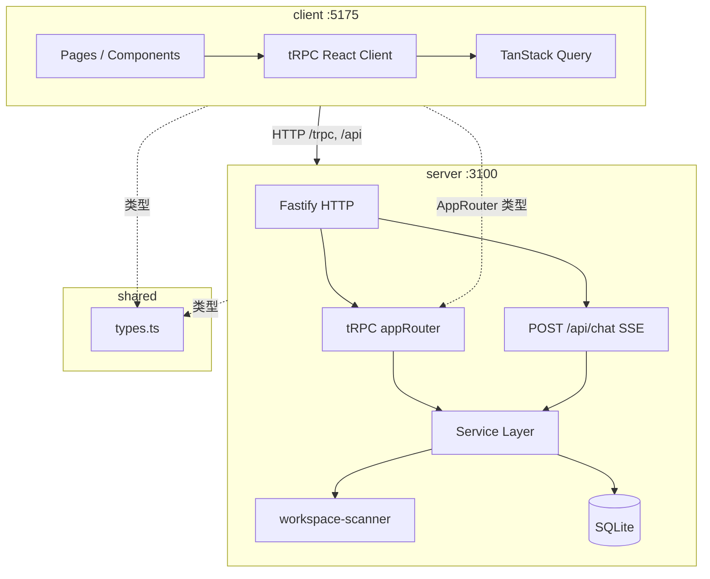

# ARCHITECTURE.md

> **读者优先级：AI Agent > 人类开发者**
>
> Monorepo 全栈架构入口。前端见 `client/ARCHITECTURE.md`；后端见 `server/ARCHITECTURE.md`；共享类型见 `shared/ARCHITECTURE.md`。

---

## 1. 系统概览



| 属性 | 值 |
|------|-----|
| 形态 | 本地单机 Web 应用 |
| Monorepo | pnpm workspace（client / server / shared） |
| 持久化 | SQLite `server/data/project-manager.db` |
| 认证 | 无 |
| 通信 | tRPC（主）+ SSE（对话） |

---

## 2. 包职责

| 包 | 文档 | 职责 |
|----|------|------|
| `client/` | `client/ARCHITECTURE.md` | React SPA、路由、UI、tRPC 消费、ChatPanel |
| `server/` | `server/ARCHITECTURE.md` | Fastify、tRPC、SQLite、Git 扫描、助手规则引擎 |
| `shared/` | `shared/ARCHITECTURE.md` | 领域类型、枚举、中文标签、跨端协议 |

---

## 3. 集成边界

### 3.1 tRPC 全链路

```
client Page
  → trpc.*.useQuery/useMutation
  → Vite proxy /trpc
  → server appRouter
  → service → SQLite
```

### 3.2 类型桥接

```typescript
// client/src/lib/trpc.ts
import type { AppRouter } from '../../../server/src/trpc/router';
```

Client 直接引用 Server 源码类型；Shared 提供领域模型，**不**导出 AppRouter。类型体系详述见 `shared/ARCHITECTURE.md`。

### 3.3 对话助手全链路

```
client ChatPanel → POST /api/chat (SSE)
  → server routes/chat.ts → assistant-service
  → NavigationAction → client useNavigationAction → react-router
```

协议类型定义在 `shared/src/types.ts`（`ChatMessage`, `NavigationAction`）。

---

## 4. 共享领域模型

**单一类型源**：`shared/src/types.ts`（文档见 `shared/ARCHITECTURE.md`）

核心实体：`Requirement`, `Repository`, `Person`, `RequirementDetail`, `WorkbenchSummary`, `RequirementGraph`, `NavigationAction`

枚举与中文标签同文件维护。Server service 层负责 DB↔TS 映射；Client 负责展示。

---

## 5. 构建与部署

```bash
pnpm dev     # shared watch + server + client 并行
pnpm build   # shared → server → client
pnpm start   # 仅 server API
```

| 包 | 产物 |
|----|------|
| shared | `shared/dist/` |
| server | `server/dist/` |
| client | `client/dist/` |

**生产**：`pnpm start` 不含静态前端；需单独托管 `client/dist` 并反向代理 `/trpc`、`/api`。

---

## 6. 配置摘要

| 项 | 位置 | 默认 |
|----|------|------|
| 前端端口 | `client/vite.config.ts` | 5175 |
| 后端端口 | `process.env.PORT` | 3100 |
| workspace 路径 | SQLite settings | `/Users/ningliu/Documents/CodeLab` |
| 数据库 | `server/data/` | gitignore |

---

## 8. 文档索引

```
IMPLEMENTATION_STATUS.md               计划书 vs 代码（实现缺口）
AGENTS.md / ARCHITECTURE.md            Monorepo 入口
client/AGENTS.md / ARCHITECTURE.md     前端
server/AGENTS.md / ARCHITECTURE.md     后端
shared/AGENTS.md / ARCHITECTURE.md     共享类型
PROJECT_MANAGER_PLATFORM_PLAN.md       原始技术方案
PROJECT_MANAGER_PRODUCT_DESIGN.md      产品语义
.cursor/rules/*.mdc                    硬性编码约束
```

---

## 9. 全局缺口

详表见 **[IMPLEMENTATION_STATUS.md](./IMPLEMENTATION_STATUS.md)**。摘要：

| 能力 | 状态 |
|------|------|
| 第一阶段 MVP | ⚠️ 主体可用 |
| 第二/三阶段 | ⚠️ 简化实现 |
| 第四阶段外部集成 | ❌ |
| 需求 update UI | ❌ |
| projects/apps 模型 | ❌ |
| assistant-ui / LLM | ❌ |
| 图谱编辑 / dependencies | ❌ |
| DB migration | ❌ |

各包细节见 `client/ARCHITECTURE.md` §12、`server/ARCHITECTURE.md` §12、`shared/ARCHITECTURE.md` §10。
