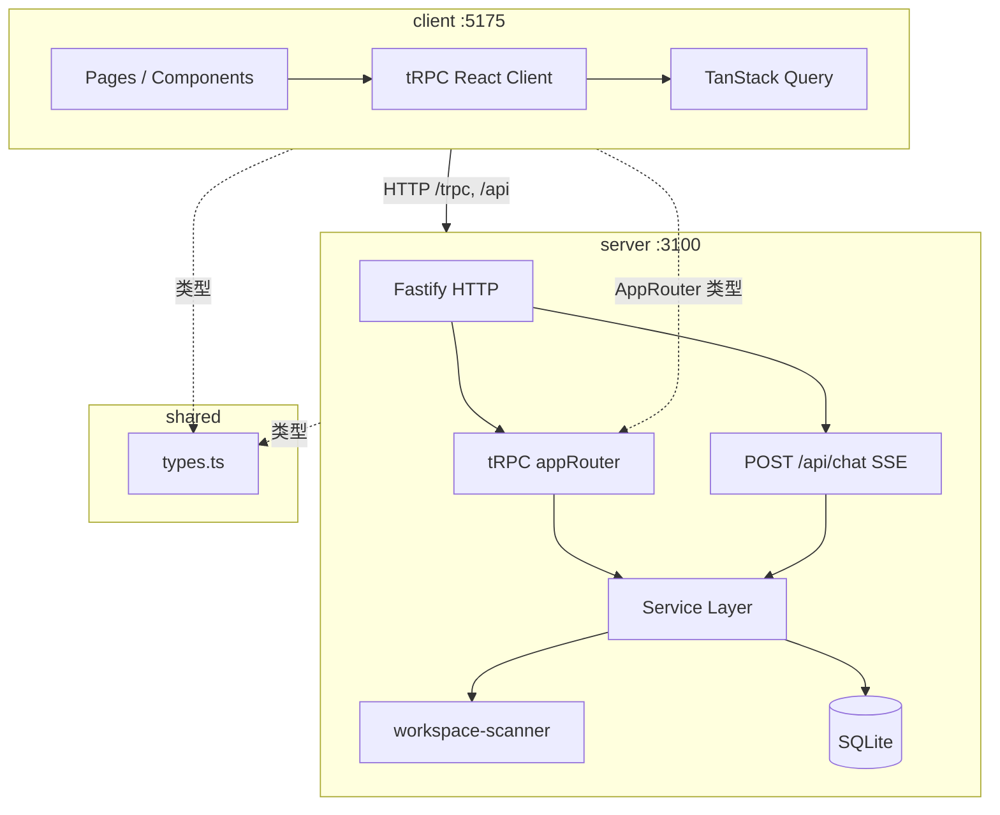
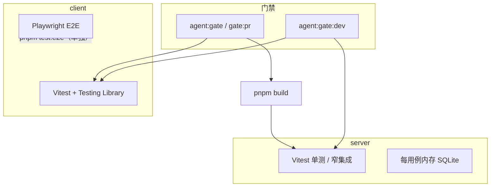

# ARCHITECTURE.md

> **读者优先级：AI Agent > 人类开发者**
>
> 操作指南见 `AGENTS.md`；全栈视图见 `../ARCHITECTURE.md`。文档索引见 [../AGENTS.md §2](../AGENTS.md#2-文档索引)。
>
> 前端见 `client/ARCHITECTURE.md`；后端见 `server/ARCHITECTURE.md`；共享类型见 `shared/ARCHITECTURE.md`。

---

## 1. 系统概览



| 属性 | 值 |
|------|-----|
| 形态 | 本地单机 Web 应用 |
| Monorepo | pnpm workspace（client / server / shared） |
| 持久化 | SQLite `server/data/project-manager.db` |
| 认证 | 无 |
| 通信 | tRPC（主）+ SSE（对话） |

---

## 2. 包职责

| 包 | 文档 | 职责 |
|----|------|------|
| `client/` | `client/ARCHITECTURE.md` | React SPA、双工作台路由、tRPC 消费、开发助手与个人助手 UI |
| `server/` | `server/ARCHITECTURE.md` | Fastify、tRPC、SQLite、Git 扫描、规则助手、待办/日程/定时任务 |
| `shared/` | `shared/ARCHITECTURE.md` | 开发域 + 个人工作台共享类型、中文标签、跨端协议与工具函数 |

---

## 3. 集成边界

### 3.1 tRPC 全链路

```
client Page
  → trpc.*.useQuery/useMutation
  → Vite proxy /trpc
  → server appRouter
  → service → SQLite
```

### 3.2 类型桥接

```typescript
// client/src/lib/trpc.ts
import type { AppRouter } from '../../../server/src/trpc/router';
```

Client 直接引用 Server 源码类型；Shared 提供领域模型，**不**导出 AppRouter。类型体系详述见 `shared/ARCHITECTURE.md`。

### 3.3 对话助手全链路

```
client ChatPanel / PersonalAssistantPanel → POST /api/chat (SSE)
  → server routes/chat.ts
  → assistant-service (dev) / personal-assistant-service (personal)
  → action / refresh / modifyMode 事件
  → client 导航或 query invalidate
```

协议类型定义在 `shared/src/types.ts`（`ChatMessage`, `NavigationAction`, `PersonalAssistantResult`）。

### 3.4 个人工作台链路

```
PersonalWorkbenchPage
  → trpc.personalWorkbench / todos / schedule / recurringTasks
  → server todo-service / schedule-service / recurring-task-service
  → SQLite（todos, todo_ai_results, schedule_*, recurring_*）
```

---

## 4. 共享领域模型

**唯一类型源**：`shared/src/types.ts`。分层说明、实体关系与 DB 对照见 **[shared/ARCHITECTURE.md](./shared/ARCHITECTURE.md)**。

工作域抽象见 `shared/src/work-model.ts`；跨域演进设计见 **[PERSONAL_WORK_ARCHITECTURE.md](./PERSONAL_WORK_ARCHITECTURE.md)**。

---

## 5. 构建与部署

见 [agents/commands-checklist.md](./agents/commands-checklist.md) 与 [agents/project-baseline.md](./agents/project-baseline.md)。

```bash
pnpm dev     # shared watch + server + client 并行
pnpm build   # shared → server → client
pnpm start   # 仅 server API
```

**生产**：`pnpm start` 不含静态前端；需单独托管 `client/dist` 并反向代理 `/trpc`、`/api`。

---

## 6. 配置摘要

| 项 | 详见 | 默认 |
|----|----------|------|
| 前端端口 | `client/vite.config.ts` | 5175 |
| 后端端口 | `process.env.PORT` | 3100 |
| workspace 路径 | SQLite `settings`（seed 见 `server/src/db/seed.ts`） | `/Users/ningliu/Documents/CodeLab` |
| 数据库路径 | `server/data/` | gitignore |

---

## 7. 测试与验证

命令与门禁见 **[agents/commands-checklist.md](./agents/commands-checklist.md)**；模块级映射、覆盖率细则与历史落地见 **[TODO/test-coverage-validation-automation.md](./TODO/test-coverage-validation-automation.md)**。

### 7.1 分层总览



| 层级 | 框架 | 命令 | 纳入 gate |
|------|------|------|-----------|
| Server 单测 / 窄集成 | Vitest 3（Node） | `pnpm --filter @project-manager/server test` | dev / PR（PR 走 `test:coverage`） |
| Client 组件单测 | Vitest 3 + jsdom + Testing Library | `pnpm --filter @project-manager/client test` | dev / PR |
| E2E 浏览器 | Playwright 1 | `pnpm test:e2e` | 否（需 dev 栈，单独执行） |

`shared` 无独立测试包；契约由 server 集成测与 client 单测间接覆盖。

### 7.2 根脚本

```bash
pnpm test              # server + client 单元测试（不 build）
pnpm test:coverage     # server 覆盖率（v8，输出 server/coverage/）
pnpm test:e2e          # client Playwright（自动起 pnpm dev）
pnpm agent:gate:dev    # test:coverage + client 单测（日常完成判定）
pnpm agent:gate        # build + test:coverage + client 单测（PR / CI）
```

### 7.3 Server 测试基础设施

| 项 | 位置 | 说明 |
|----|------|------|
| 配置 | `server/vitest.config.ts` | glob `src/**/*.test.ts`；覆盖率 provider v8 |
| DB 隔离 | `src/test/setup.ts` | 每用例 `:memory:` SQLite + `initTestDb` / `resetTestDb` |
| tRPC 窄集成 | `src/test/trpc-test-server.ts` · `trpc-http.ts` | HTTP → router(Zod) → service → SQLite |
| SSE 集成 | `src/test/chat-test-server.ts` · `sse-parse.ts` | `/api/chat` 事件解析与断言 |
| 覆盖率分母 | `vitest.config.ts` | `assistant/**` + 个人工作台 `services/`；**不含**开发域 `requirement-service` 等 |

### 7.4 Client 测试基础设施

| 项 | 位置 | 说明 |
|----|------|------|
| 单测配置 | `client/vitest.config.ts` | glob `src/**/*.test.{ts,tsx}`；jsdom；`src/test/setup.ts` mock `matchMedia` |
| E2E 配置 | `client/playwright.config.ts` | `e2e/*.spec.ts`；`baseURL` 5175；`webServer` 根目录 `pnpm dev` |
| E2E 辅助 | `client/e2e/helpers.ts` | `trpcQuery` / `trpcMutation` / `mockChatSse` / `gotoPersonalWorkbench` |

### 7.5 E2E 用例分布

| 文件 | 覆盖域 |
|------|--------|
| `personal-workbench-smoke.spec.ts` | 首页加载、Tab 切换、开发域入口 |
| `personal-workbench-todo.spec.ts` | 待办 UI 创建 |
| `personal-workbench-modify.spec.ts` | 修改模式进入 / SSE / 退出 |
| `requirements.spec.ts` | 工作列表 URL 筛选、详情页 |
| `dev-assistant-navigation.spec.ts` | 开发助手导航动作 |
| `scan-center.spec.ts` | 扫描中心工作区路径保存 |

### 7.6 规模快照

以 `pnpm test` 为准（随用例增减波动）：

| 包 | 测试文件 | 用例数 |
|----|----------|--------|
| server | 30 | 173 |
| client 单测 | 4 | 26 |
| client E2E | 6 | 13 |

---

## 8. 文档索引

文档索引见 **[AGENTS.md §2.1](./AGENTS.md#21-文档对照表)**。

```
IMPLEMENTATION_STATUS.md               实现状态（计划 vs 代码）
AGENTS.md                              Agent 入口与文档索引
ARCHITECTURE.md                        本文件（全栈集成）
TODO/test-coverage-validation-automation.md  测试框架、覆盖率与 gate 细则
client/ · server/ · shared/           包级 AGENTS + ARCHITECTURE
PROJECT_MANAGER_*.md                   产品与技术方案（规划）
docs/个人工作台/个人工作台.md          个人工作台产品需求
.cursor/rules/*.mdc                    Cursor 硬性编码约束
```

---

## 9. 实现状态

**实现状态**：[IMPLEMENTATION_STATUS.md](./IMPLEMENTATION_STATUS.md)。

各包实现细节见 `client/ARCHITECTURE.md`、`server/ARCHITECTURE.md`、`shared/ARCHITECTURE.md` 文末索引节。
