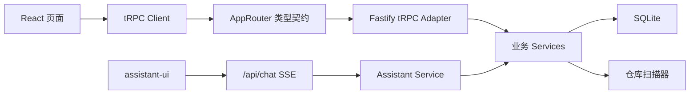
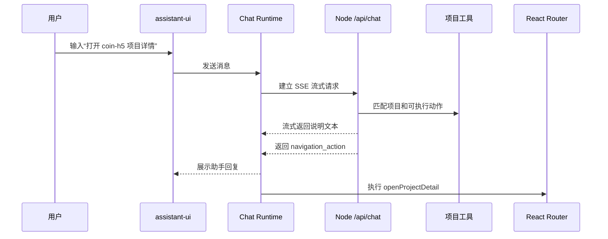
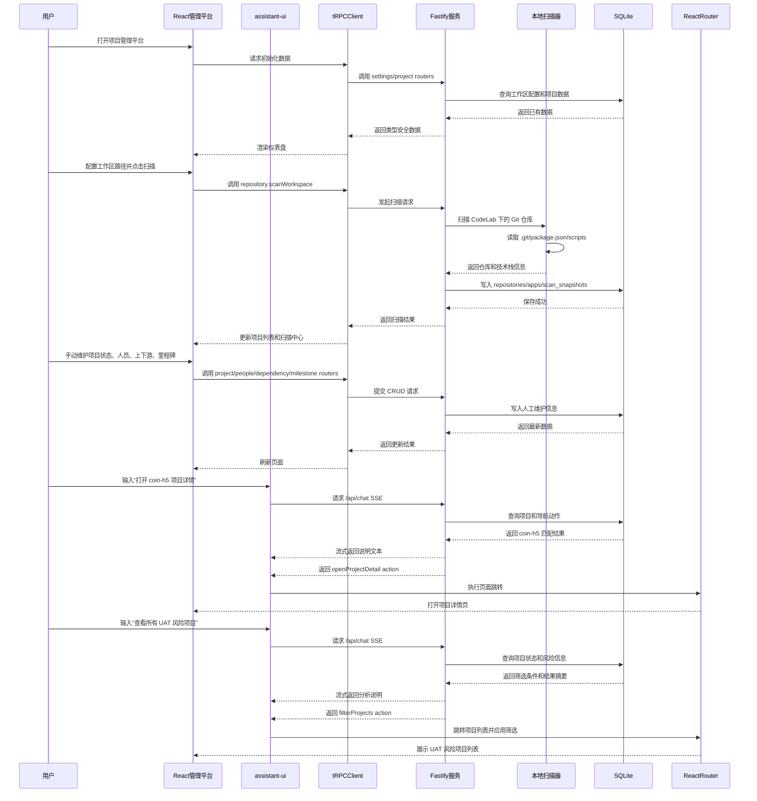

# 项目管理平台方案

关联产品设计说明书：[项目管理平台产品设计说明书](./PROJECT_MANAGER_PRODUCT_DESIGN.md)

> **实现进度**：见 [IMPLEMENTATION_STATUS.md](./IMPLEMENTATION_STATUS.md)（计划书 vs 当前代码对照）。

## 背景判断

当前工作区 `/Users/ningliu/Documents/CodeLab` 下识别到 19 个独立 Git 仓库，包括 `Fosun-UI`、`admin-portal`、`coin-h5`、`fsw-vue-operation-apps`、`fsw-ai-skills-hub`、`opman-web-new` 等。多数项目是 Vue/Node 生态：

- `opman-web-new/package.json`：Vue2 + Vue CLI，包含大量后台子项目和 `dev/sit/uat/prod/gray` 构建脚本。
- `fsw-vue-operation-apps/package.json`：pnpm + Nx + Vite，包含多个 apps/packages。
- `fsw-ai-skills-hub/package.json`：Vue + Vite + TypeScript + Nx。
- `admin-portal/package.json`：Vue2 + View Design。
- `coin-h5/package.json`：Vue2/Vue CLI + Vant + 移动端配置。

结论：平台后续新建为独立本地 Web 应用，不侵入现有业务仓库；技术栈优先贴合现有前端资产中的 Vite、TypeScript、Node 工具链，同时前端采用 React + Vite + TypeScript，后端采用 Node 本地服务。

## 产品目标

首版围绕“你的个人项目管理驾驶舱”提供 6 个核心能力：

- 我的工作台：以你的管理视角展示待推进、待确认、待验收、待上线和高风险的需求。
- 需求总览：展示需求状态、优先级、负责人、上下游协作人员、关联仓库、上线窗口和风险标记。
- 项目总览：显示所有仓库、技术栈、当前分支、Git 状态、最后提交、构建环境、风险标记。
- 上下游关系：围绕需求可视化展示上游开发人员、下游交互人员、关联仓库、公共组件、接口/业务协作关系。
- 任务与里程碑：围绕需求维护版本计划、当前状态、阻塞项、上线窗口、待办事项。
- 可视化 CRUD：列表、详情、表单和关系图都能增删改查，自动扫描字段和手工字段清晰分层。
- 对话式导航：接入 `assistant-ui` 作为 React 流式对话组件，通过自然语言查询我的需求、定位需求详情、筛选仓库关联、打开关系图或进入编辑表单。

## 推荐架构

```mermaid
flowchart LR
  workspaceRoot["CodeLab 工作区"] --> scanner["本地仓库扫描器"]
  scanner --> gitInfo["Git 信息"]
  scanner --> packageInfo["package.json 和脚本"]
  scanner --> repoHints["README/配置线索"]
  gitInfo --> api["Node.js Fastify API"]
  packageInfo --> api
  repoHints --> api
  api --> db["SQLite 本地数据库"]

  web["React 管理平台"] --> router["React Router"]
  web --> trpcClient["tRPC React Client"]
  trpcClient --> query["TanStack Query"]
  web --> state["Zustand UI 状态"]
  web --> antd["Ant Design 页面组件"]
  web --> graph["关系图谱"]
  web --> assistantUI["assistant-ui 对话组件"]

  assistantUI --> chatRuntime["Chat Runtime 适配层"]
  chatRuntime --> streamApi["/api/chat SSE 流式接口"]
  streamApi --> aiOrchestrator["AI 编排与意图解析"]
  aiOrchestrator --> projectTools["项目查询工具"]
  aiOrchestrator --> navigationTools["导航动作工具"]
  projectTools --> api
  api --> db
  navigationTools --> router
  query --> trpcRouter["tRPC Routers"]
  trpcRouter --> api
```

后续如果进入开发，建议创建独立目录 `project-manager/`：

- 前端：React + Vite + TypeScript + React Router + Zustand/TanStack Query + Ant Design。
- 前后端契约：采用 `tRPC`，在 Fastify 中挂载 tRPC router，React 端通过 `@trpc/react-query` 获得端到端类型安全。
- 对话组件：采用 `assistant-ui` 作为消息线程、输入框、流式状态和工具调用展示层；通过自定义 Runtime 接入后端 SSE 流式接口。
- AI 编排：Node 服务提供 `/api/chat`，负责拼接项目上下文、调用大模型或本地规则、输出流式文本和结构化 action。
- 导航动作：前端注册 `openProjectDetail`、`filterProjects`、`openDependencyGraph`、`openEditForm` 等 action；助手返回结构化动作后由 React Router 和页面状态执行。
- 图谱：`@xyflow/react` 或 ECharts graph，用于上下游关系、团队协作和项目依赖网络。
- 后端：Node.js + Fastify，负责扫描本地仓库、读取 Git/package 信息、挂载 tRPC API，并提供 `/api/chat` SSE 流式接口。
- 存储：SQLite，保存手动维护信息；自动扫描信息可缓存并支持重新扫描。
- Git 采集：用 `simple-git` 或命令封装读取 `remote`、当前分支、工作区状态、最近提交、提交人。

## 前后端契约设计

普通业务接口统一走 `tRPC`，避免手写 REST DTO 和重复类型定义；只有对话流式输出保留独立 SSE 接口，因为它需要持续推送 token、工具调用状态和最终导航动作。

建议按业务域拆分 tRPC router：

- `repositoryRouter`：仓库列表、仓库详情、Git 状态、重新扫描结果查询。
- `projectRouter`：项目 CRUD、状态更新、风险标记、业务域筛选。
- `peopleRouter`：关联人员 CRUD、上下游人员查询、需求责任人和沟通对象维护。
- `requirementRouter`：需求 CRUD、需求状态更新、人员关联、仓库关联、风险标记和上线计划维护。
- `dependencyRouter`：上下游关系 CRUD、图谱节点和边查询。
- `milestoneRouter`：里程碑 CRUD、阻塞项和上线计划维护。
- `settingsRouter`：工作区路径、忽略目录、枚举配置。
- `assistantRouter`：对话历史、可用导航动作、对话结果回放；实时生成仍由 `/api/chat` SSE 处理。



## 对话式导航设计

`assistant-ui` 只负责 React 侧对话体验，真正的业务能力通过“工具”和“导航动作”暴露给助手，保证对话结果可控、可审计、可回放。



首版支持的对话动作（**实现上以需求为中心命名**，如 `openRequirementDetail`、`filterRequirements`）：

- `openRequirementDetail(requirementId)`：跳转需求详情（计划书原称 openProjectDetail）。
- `filterRequirements(filters)`：进入需求列表并应用筛选（状态/人员/仓库/风险/上线窗口等）。
- `openGraph(requirementId?)`：打开需求关系图谱（计划书原称 openDependencyGraph）。
- `openPersonView(personId)`：查看协作人员参与的需求（第二阶段）。
- `openEditForm(entityType, entityId)`：进入需求、人员、里程碑编辑（第二阶段）。
- `openScanCenter` / `triggerWorkspaceScan()`：进入或触发扫描中心。

## 数据模型

建议把“自动扫描”和“人工维护”拆开，避免重新扫描覆盖人工信息：

- `repositories`：仓库路径、名称、Git remote、默认分支、当前分支、最后提交、是否有未提交改动。
- `projects`：项目名称、业务域、状态、优先级、风险等级、阶段、负责人、说明。
- `apps`：monorepo 子应用或业务模块，例如 `fsw-vue-operation-apps/apps/*`、`opman-web-new` 的多项目脚本。
- `requirements`：独立需求主体，维护状态、优先级、负责人、目标版本、关联链接、上线窗口、风险和阻塞项。
- `requirement_repositories`：需求与仓库的多对多关系，支持一个仓库并行多个需求、一个需求关联多个仓库，并维护仓库职责、开发分支、环境、交付状态和风险。
- `requirement_apps`：需求与项目/应用的多对多关系，记录应用范围、负责人、交付状态和备注。
- `people`：关联人员主数据，用于维护上游开发人员和下游交互人员的姓名、角色、联系方式、所属团队。
- `project_people`：项目与人员的多对多关系，区分负责人、前端、后端、测试、产品、运维等角色。
- `requirement_people`：需求与人员的多对多关系，区分主负责人、参与人、关注人、上游开发人员和下游交互人员，并维护角色、责任说明、协作状态和阻塞信息。
- `dependencies`：上游/下游/公共库/接口依赖/业务协作关系。
- `milestones`：版本、目标、时间、状态、阻塞项。
- `links`：YApi、Figma、Sentry、GitLab、CI、发布系统、文档等外部链接。
- `chat_sessions` / `chat_messages`：保存对话上下文、用户指令、助手响应和触发的导航动作。
- `navigation_actions`：定义可被对话触发的页面跳转、筛选条件、详情定位和编辑入口。
- `scan_snapshots`：每次扫描结果，用于比较项目状态变化。

## 自动扫描范围

首版自动采集这些低风险信息：

- 根目录下包含 `.git` 的仓库列表。
- 每个仓库的 Git remote、当前分支、最近提交、是否 dirty。
- `package.json` 中的项目名、描述、scripts、dependencies、devDependencies。
- 脚本中识别环境：`dev`、`sit`、`uat`、`prod`、`gray`。
- monorepo 结构：`apps/*`、`packages/*`、pnpm workspace、Nx 配置。
- 技术标签：Vue2、Vue3、Vite、Vue CLI、Vant、Element UI、View Design、ECharts、Sentry 等。

不建议首版自动推断复杂业务上下游，因为误判成本高；上下游关系先由页面手动维护，后续再根据 `@fs/*` 公共包、接口配置、YApi 文档、README 逐步增强。

## 页面规划

> **第一阶段页面**（需求 MVP）：我的工作台、需求列表、需求详情、仓库资产、关联人员、扫描中心、配置中心；全局 FAB 规则对话（非 assistant-ui）。  
> **第二阶段页面**：关系图谱编辑、关联人员独立视图、assistant-ui 对话面板。

- 对话助手：全局固定入口（第一阶段为规则引擎 + SSE；第二阶段为 assistant-ui 流式输出）；支持「打开需求详情」「查看风险需求」「按人员/仓库筛选」等指令后跳转或更新列表筛选。
- 我的工作台：**第一阶段**；首页展示待推进、待确认、风险、上线窗口等**需求**聚合。
- 需求列表：**第一阶段**；按状态、人员、仓库、风险、上线窗口、关键词筛选。
- 需求详情：**第一阶段**；基础信息、关联人员、关联仓库、里程碑、风险、关联链接；编辑/删除需求。
- 项目/仓库列表：**第一阶段**（仓库资产）；反查并行需求；按技术栈/Git 状态展示扫描信息。
- 关联人员：**第一阶段**（人员主数据 CRUD）；第二阶段补充按人员反查需求视图。
- 扫描中心 / 配置中心：**第一阶段**。
- 关系图谱：**第二阶段**（第一阶段可只读预览）；节点/边编辑、dependencies 持久化。

## 用户使用流程



## 分阶段实施

> **核心原则**：MVP 的管理主轴是**需求**（`requirements`），不是 `projects` 表。第一阶段必须交付「以我的需求为中心」的完整闭环；仓库扫描、配置中心等是为需求提供上下文的支撑能力，同属第一阶段。

### 第一阶段 MVP：以需求为中心

**阶段目标**：独立本地 Web 应用 → 工作区扫描 → SQLite 持久化 → **需求全生命周期 CRUD 与关联维护** → 工作台与列表筛选 → 可日常使用。

#### 需求本体

| 能力 | 范围 |
|------|------|
| 新建 / 编辑 / 删除 | 名称、状态（7 种）、优先级、目标版本、计划上线、风险、阻塞项、备注 |
| 需求列表 | `/requirements` 表格展示，跳转详情 |
| 需求详情 | `/requirements/:id` 只读展示 + 编辑入口 |

#### 需求关联（多对多 CRUD）

| 关联 | 能力 |
|------|------|
| 关联仓库 | 增删；职责、开发分支、环境、交付状态、风险 |
| 关联人员 | 增删；上游/下游、管理角色、角色类型、职责、协作状态 |
| 里程碑 | 增删改；名称、目标日期、状态、阻塞项 |
| 外部链接 | 增删；类型、标题、URL（Figma/YApi 等手工维护） |
| 人员主数据 | `/people` 列表 + 新增/编辑/删除，供需求关联选用 |

#### 需求视角的工作台与筛选

| 能力 | 说明 |
|------|------|
| 我的工作台 | 待推进、待确认、风险需求、上线窗口、统计卡片 |
| 列表筛选 | 状态、关联人员、关联仓库、关键词、仅风险、尚未提测、上线窗口（含本周） |
| 仓库反查 | 仓库资产页查看每个仓库并行承接的需求 |

#### 第一阶段支撑能力（服务需求，非第二主体）

| 能力 | 说明 |
|------|------|
| 工作区扫描 | 一级目录 `.git` 仓库；Git / package.json / 技术标签 / 环境脚本 |
| 扫描中心 | 触发扫描、最近快照、**异常仓库列表** |
| 配置中心 | 工作区路径、**扫描忽略目录** |
| 字段分层 | 重扫仅 UPSERT `repositories` 扫描列；**需求及关联表与扫描隔离** |
| 基础对话跳转 | 规则引擎：打开需求详情、筛选风险/人员/未提测/本周上线（**非** assistant-ui / LLM） |

#### 第一阶段数据表

`requirements` · `requirement_repositories` · `requirement_people` · `milestones` · `links` · `people` · `repositories` · `scan_snapshots` · `settings`

**第一阶段不含**：`projects` · `apps` · `requirement_apps` · `dependencies` · `chat_sessions` · 图谱边持久化

#### 第一阶段验收（需求 MVP）

- 能从工作台/列表进入需求，完成需求增删改查。
- 能在详情页维护关联仓库、上下游人员、里程碑、链接。
- 能按状态/人员/仓库/风险/上线窗口筛选需求列表。
- 能查看工作区仓库并反查并行需求；重扫不破坏任何需求数据。
- 能在配置中心设置工作区路径与忽略目录。

---

### 第二阶段：项目经理视角增强

在需求 MVP 可用基础上补齐：

- 关系图谱**只读展示**升级为**节点/边可视化编辑**；`dependencies` 边模型持久化。
- 关联人员**独立视图**（按人员反查需求、Person 详情页）。
- `assistant-ui` 替换自研 `ChatPanel`；LLM 编排与会话持久化（`chat_sessions`）。
- 对话动作补全：`openEditForm`、`openPersonView`、`triggerWorkspaceScan` 等。
- 需求关联仓库/人员的**就地编辑**（不必删后重建）。

### 第三阶段：自动化增强

- 识别 monorepo 子应用（`apps` / `requirement_apps`）；`projects` 实体（若仍需要）。
- pnpm workspace / Nx 配置识别；README/配置线索。
- 对话助手基于结构化扫描数据回答复杂项目状态问题。

### 第四阶段：外部系统集成

YApi、Sentry、Figma、CI、GitLab/GitHub、飞书文档等，通过 MCP 或 API 按需扩展；`links` 从手工 URL 升级为可拉取的外部数据。

## 验收标准

### 第一阶段（需求 MVP）✅ 当前实现对照见 [IMPLEMENTATION_STATUS.md §2](./IMPLEMENTATION_STATUS.md)

- 打开平台后从「我的工作台」查看待推进、待确认、风险和临近上线的**需求**。
- 从工作台/列表进入**需求详情**，查看关联仓库、上下游人员、里程碑、链接、风险与阻塞项。
- **需求**可可视化新增、编辑、删除；关联仓库/人员/里程碑/链接可维护。
- **需求列表**可按状态、人员、仓库、风险、上线窗口等筛选。
- 查看工作区所有独立仓库，并反查每个仓库并行承接的需求。
- 仓库展示自动扫描信息；重扫不覆盖需求及任何人工维护的关联数据。
- 配置中心可设置工作区路径与扫描忽略目录；扫描中心可查看异常仓库。

### 第二阶段及以后

- 关系图谱可编辑，能回答并行、协作、风险等结构问题（当前为只读展示）。
- 能通过 `assistant-ui` 对话完成核心导航（打开详情、筛选、关系图、编辑表单）。
- 需求可关联项目/应用（`requirement_apps`，第三阶段）。
- 外部系统（YApi/Figma/Sentry 等）可集成拉取，不仅手工存 URL。

## 实施任务

### 第一阶段（需求 MVP）

- 确认平台只作为独立本地 Web 应用开发，不集成进现有业务项目。
- 创建 `project-manager/`，初始化 React/Vite/TypeScript 前端和 Node 本地 API。
- 建立 SQLite：`requirements`、`requirement_repositories`、`requirement_people`、`milestones`、`links`、`people`、`repositories`、`scan_snapshots`、`settings`。
- 实现工作区仓库扫描器（一级目录 Git、package.json、环境脚本、技术标签；忽略目录；异常记录）。
- 实现**我的工作台**、**需求列表**（含筛选）、**需求详情**（含编辑/删除）。
- 实现需求关联仓库、关联人员、里程碑、链接的 CRUD 页面；**人员主数据** CRUD。
- 实现**仓库资产**（反查并行需求）、**扫描中心**、**配置中心**。
- 实现基础规则对话（打开需求详情、筛选需求），SSE `/api/chat`。
- 用 CodeLab 工作区扫描验证数据准确性和交互流程。

### 第二阶段及以后

- 实现关系图谱节点/边可视化编辑与 `dependencies` 持久化。
- 接入 `assistant-ui`，实现流式对话、会话持久化与完整导航动作集。
- 实现 monorepo 子应用识别与 `apps` / `requirement_apps` 模型。
- 接入 YApi/Sentry/Figma 等外部系统 MCP/API。

## 后续执行建议

如果确认进入开发，建议从 `project-manager/` 独立应用开始，先实现扫描器和数据模型，再做页面。这样不会影响现有 19 个业务仓库，也方便后续把平台作为个人管理工具持续迭代。
