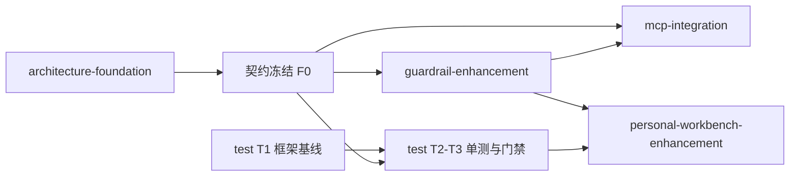

# TODO 总路线图

> **SSOT**：`TODO/` 目录的**索引与依赖关系**唯一来源。实现状态以 [IMPLEMENTATION_STATUS.md](../IMPLEMENTATION_STATUS.md) 为准；全项目文档映射见 [AGENTS.md §2.1](../AGENTS.md#21-权威映射表)。

本路线图统一管理个人工作台 AI 化相关待办，按「**先契约、后实现**」推进：五层底座与测试验证可先对齐并冻结接口契约，再各自以契约为准并行落地。

---

## 本目录文档映射（SSOT）

| 文件 | 职责（唯一定义） | 引用方（勿重复展开） |
|------|------------------|----------------------|
| **roadmap.md**（本文件） | 优先级、依赖图、执行顺序 | 各子待办文首 |
| **docs/个人工作台/个人工作台-技术功能点.md** | TL1–TL4 **技术实现对照**与**完成状态** SSOT | `personal-workbench-enhancement` · `architecture-foundation` · `test-coverage-validation-automation` · `IMPLEMENTATION_STATUS` §13 |
| **architecture-foundation.md** | 五层底座**接口契约**与目录规划（F0 冻结；**F1–F3 已落地**） | `mcp-integration`、`guardrail-enhancement`、`test-coverage-validation-automation`、技术功能点 §TL1-05 |
| **guardrail-enhancement.md** | 四层护栏**规则细则**与验收场景 | `architecture-foundation` §3.3 仅保留接口 |
| **test-coverage-validation-automation.md** | 测试框架、覆盖率与门禁接入计划（**以底座契约为准**） | 技术功能点 §已验收 |
| **mcp-integration.md** | 外部 MCP（飞书文档等）接入计划 | `architecture-foundation` §3.4 |
| **personal-workbench-enhancement.md** | 个人工作台**未完成**功能点与 Phase E 待办 | 完成状态见 `个人工作台-技术功能点.md` §实现状态总览 |

**产品需求**不在 `TODO/` 定义：`docs/个人工作台/个人工作台.md` 为个人工作台产品 SSOT；**技术 TL4 对照**见 `docs/个人工作台/个人工作台-技术功能点.md`。

---

## 优先级总览

| 优先级 | 待办 | 依赖 | 目标 |
|---|---|---|---|
| P0 | [architecture-foundation.md](./architecture-foundation.md) | 无 | F0 冻结；**F1–F3 已落地**；F4 待 MCP |
| P0 | [test-coverage-validation-automation.md](./test-coverage-validation-automation.md) T1 | 无 | 测试框架与 gate 接入（**已完成**） |
| P1 | [guardrail-enhancement.md](./guardrail-enhancement.md) | F0 + F3 | 规则细则与 G1–G5（**引擎已落地**，细则勾选见该文件） |
| P1 | [test-coverage-validation-automation.md](./test-coverage-validation-automation.md) T2–T3 | F0 | 五层单测 + gate（**已完成**） |
| P2 | [mcp-integration.md](./mcp-integration.md) | F4 + guardrail | Feishu Document MCP → `externalSnippets` |
| P2 | [personal-workbench-enhancement.md](./personal-workbench-enhancement.md) Phase E | F1–F3 | 待办知识库 RAG（**唯一未收口 Phase**） |
| — | [personal-workbench-enhancement.md](./personal-workbench-enhancement.md) Phase A–D / B4 / F | — | **已收口**（见 [技术功能点 §实现状态总览](../docs/个人工作台/个人工作台-技术功能点.md#实现状态总览)） |

---

## 依赖关系图

---

## 建议执行顺序

1. **契约对齐**：完成 `architecture-foundation.md` F0 评审，冻结五层接口与目录边界；`test-coverage-validation-automation.md` 同期对齐单测范围与黄金话术，写入同一契约基线。
2. **并行落地**：
   - `test-coverage-validation-automation.md` **T1**（Vitest、`pnpm test`、gate 路径）可与 F0 **同步启动**，不依赖底座编码；
   - F0 冻结后，**以契约为准**并行推进 `guardrail-enhancement.md` 与 test **T2–T3**（IntentRouter / ToolRegistry / guardrail-engine 单测）。
3. 护栏可用后接入 `mcp-integration.md`（**F4**），优先落地 Feishu Document MCP。
4. 推进 `personal-workbench-enhancement.md` **Phase E**（RAG）；Phase A–F 其余项已收口。

> **说明**：test 不等待五层底座 **F1–F4 编码完成**；仅 T2 中针对五层抽象的用例依赖 F0 契约冻结。现有 service（如 `recurring-task-scheduler`）单测可在 T1 后即写。

---

## 对应待办文件

- [architecture-foundation.md](./architecture-foundation.md)
- [guardrail-enhancement.md](./guardrail-enhancement.md)
- [test-coverage-validation-automation.md](./test-coverage-validation-automation.md)
- [mcp-integration.md](./mcp-integration.md)
- [personal-workbench-enhancement.md](./personal-workbench-enhancement.md)
