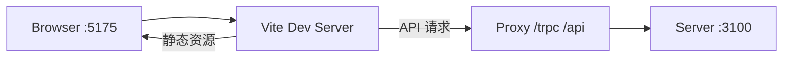
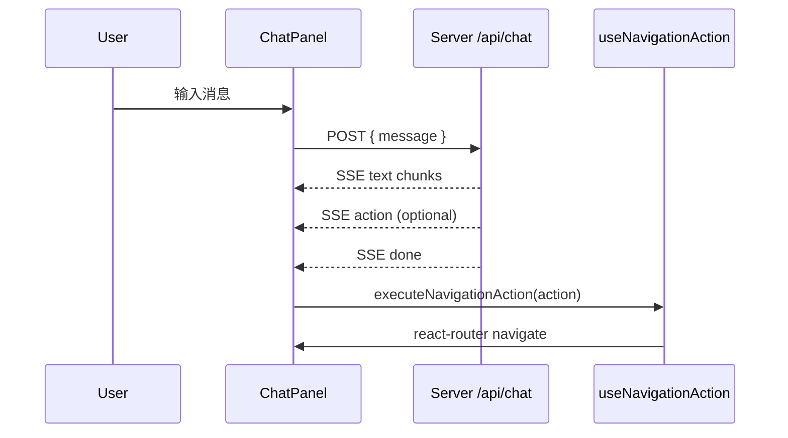

# Client ARCHITECTURE.md

> **读者优先级：AI Agent > 人类开发者**
>
> 前端架构**引用层**。操作指南见 `AGENTS.md`；全栈视图见 `../ARCHITECTURE.md`。SSOT 映射见 [../AGENTS.md §2](../AGENTS.md#2-文档映射ssot)。

---

## 1. 在系统中的位置



| 属性 | 值 |
|------|-----|
| 包名 | `@project-manager/client` |
| 构建 | Vite 6 + `@vitejs/plugin-react` |
| 产物 | `client/dist/` 静态 SPA |
| 后端通信 | tRPC（主）+ REST SSE（对话） |

---

## 2. Bootstrap 与 Provider 栈

**入口**：`src/main.tsx`

```
StrictMode
└── trpc.Provider          httpBatchLink({ url: '/trpc' })
    └── QueryClientProvider   staleTime: 30s, refetchOnWindowFocus: false
        └── BrowserRouter
            └── App
```

**tRPC 类型桥**（`src/lib/trpc.ts`）：

```typescript
import type { AppRouter } from '../../../server/src/trpc/router';
export const trpc = createTRPCReact<AppRouter>();
```

运行时无 server 代码；build 时 server 源码须存在以解析类型。

---

## 3. 应用壳

**`src/App.tsx`** 职责：

- 双壳层路由：`/` 个人工作台（顶栏三 Tab：日程与事项 / 定时任务 / **开发域**），`/dev-dashboard` 及开发域页面走 `DevShell`
- `<Routes>` 注册 9 个页面（含周报与个人工作台）
- 全局挂载 `<ChatPanel />`（开发域助手 FAB + Drawer）

布局 class 定义在 `src/styles/global.css`：`.app-shell`, `.app-header`, `.app-nav`, `.app-main`。

---

## 4. 路由架构

| Path | Component | URL 参数 |
|------|-----------|----------|
| `/` | PersonalWorkbenchPage | — |
| `/dev-dashboard` | MyWorkbenchPage | — |
| `/requirements` | RequirementsPage | `riskOnly`, `keyword` |
| `/requirements/:id` | RequirementDetailPage | `id` |
| `/weekly-report` | WeeklyReportPage | `weekStart/End`（由页面计算） |
| `/graph` | GraphPage | `requirementId` |
| `/repositories` | RepositoriesPage | — |
| `/people` | PeoplePage | — |
| `/scan` | ScanCenterPage | — |

无路由级 lazy load；无嵌套路由。

---

## 5. 状态管理

| 状态 | 方案 | 位置 |
|------|------|------|
| 服务端数据 | TanStack Query via tRPC | 各 Page |
| URL 筛选 | `useSearchParams` | RequirementsPage, GraphPage |
| 对话消息 | `useState<ChatMessage[]>` | ChatPanel |
| 全局 UI | 无 Redux/Zustand | — |

**缓存失效模式**：

```typescript
const utils = trpc.useUtils();
await mutation.mutateAsync(...);
await utils.requirements.list.invalidate();
```

---

## 6. 页面与组件

### 6.1 Pages

| 页面 | 职责 |
|------|------|
| `PersonalWorkbenchPage` | 个人工作台容器（待办/日程/定时任务 + 个人助手） |
| `MyWorkbenchPage` | 工作台四象限 + 统计卡片 |
| `RequirementsPage` | 需求列表、新建 Modal、URL 筛选 |
| `RequirementDetailPage` | 详情 + 仓库/人员/里程碑/链接关联 CRUD |
| `WeeklyReportPage` | 周区间选择、周报生成、预览/编辑/复制 |
| `GraphPage` | ReactFlow 只读关系图 |
| `RepositoriesPage` | 仓库列表 + 分支展开管理（备注/同步/删除/打开） |
| `PeoplePage` | 人员 CRUD + 飞书会话快捷打开 |
| `ScanCenterPage` | 工作区路径/忽略目录配置 + 触发扫描 + 最近快照 |

### 6.2 Components

| 组件 | 职责 |
|------|------|
| `RequirementList` | 需求列表表格复用 |
| `ChatPanel` | 开发域 SSE 对话 + 导航动作触发 |
| `personal-workbench/*` | `TodoPanel`/`ScheduleTimeline`/`RecurringTaskPanel`/`PersonalAssistantPanel`/`AiResultPanel` |

### 6.3 Hooks

| Hook | 职责 |
|------|------|
| `useNavigationAction` | 将 `NavigationAction` 映射为 `navigate()` |

---

## 7. 对话助手（Client 侧）



- 协议类型：`ChatMessage`, `NavigationAction`, `PersonalAssistantResult`（来自 `@project-manager/shared`）
- 开发域助手：`ChatPanel`，发送 `{ message }`，主要消费 `text/action/done`
- 个人助手：`PersonalAssistantPanel`，发送 `{ message, context: 'personal', modifyTodoId?, sessionId? }`，消费 `text/refresh/modifyMode/done`
- SSE 解析在 `ChatPanel.tsx` / `PersonalAssistantPanel.tsx`；开发域动作执行在 `useNavigationAction.ts`

**NavigationAction 路由映射**：

| type | navigate 目标 |
|------|---------------|
| `openWorkbench` | `/` |
| `openScanCenter` | `/scan` |
| `openGraph` | `/graph` 或 `/graph?requirementId=` |
| `openRequirementDetail` | `/requirements/:id` |
| `filterRequirements` | `/requirements?riskOnly=&keyword=` |

---

## 8. 关系图谱（Client 侧）

- 库：`@xyflow/react`
- 数据：`trpc.graph.get.useQuery({ requirementId })`
- 布局：简单 grid；**只读**，无编辑回写
- 背景：`<Background gap={16} />`

---

## 9. 个人工作台（Client 侧）

- 页面：`PersonalWorkbenchPage`
- 子模块：待办（含 AI 结果确认/修改）、日程时间线、定时任务、个人助手
- 主要查询：`personalWorkbench.summary`、`todos.list`、`schedule.listDay`、`recurringTasks.list`
- 主要交互：个人助手 SSE 触发 `refresh` 后调用对应 query invalidate

---

## 10. UI 体系

- **组件库**：Ant Design 5（Table, Form, Modal, Drawer, Spin, Tag, Descriptions, Popconfirm, message）
- **样式**：`src/styles/global.css` — CSS 变量暖色驾驶舱主题
- **路径别名**：`@/` → `src/`（`vite.config.ts` + `tsconfig.json`）
- **布局 class**：`.content-card`, `.panel-grid`, `.list-row`, `.detail-grid`, `.empty-hint`
- **无** ConfigProvider 主题定制

---

## 11. 构建与代理

**`vite.config.ts`**：

| 配置 | 值 |
|------|-----|
| `server.port` | 5175 |
| `resolve.alias['@']` | `src/` |
| proxy `/trpc` | → localhost:3100 |
| proxy `/health` | → localhost:3100 |
| proxy `/api` | → localhost:3100 |

**构建**：`tsc -b && vite build` → `dist/`

---

## 12. 依赖关系

```
@project-manager/shared     领域类型、NavigationAction、标签常量
@trpc/client + @trpc/react-query
@tanstack/react-query
antd, react, react-dom, react-router-dom
@xyflow/react               仅 GraphPage
```

**类型依赖**（非 npm）：`server/src/trpc/router` → `AppRouter`

---

## 13. 实现状态

**唯一对照来源**：[../IMPLEMENTATION_STATUS.md](../IMPLEMENTATION_STATUS.md)。不在本文件维护缺口表。

---

## 14. 关键文件索引

```
src/main.tsx
src/App.tsx
src/lib/trpc.ts
src/hooks/useNavigationAction.ts
src/components/ChatPanel.tsx
src/components/RequirementList.tsx
src/pages/MyWorkbenchPage.tsx
src/pages/PersonalWorkbenchPage.tsx
src/pages/RequirementsPage.tsx
src/pages/RequirementDetailPage.tsx
src/pages/WeeklyReportPage.tsx
src/pages/GraphPage.tsx
src/pages/RepositoriesPage.tsx
src/pages/PeoplePage.tsx
src/pages/ScanCenterPage.tsx
src/components/personal-workbench/TodoPanel.tsx
src/components/personal-workbench/ScheduleTimeline.tsx
src/components/personal-workbench/RecurringTaskPanel.tsx
src/components/personal-workbench/PersonalAssistantPanel.tsx
src/utils/labels.ts
src/utils/feishu.ts
src/styles/global.css
vite.config.ts
```
