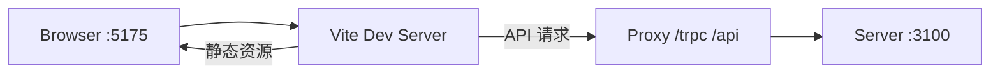
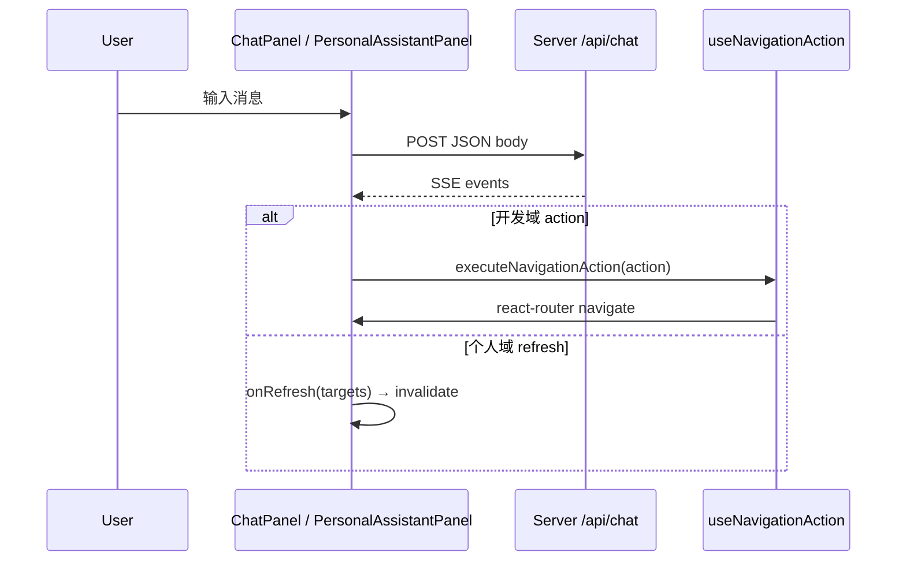

# Client ARCHITECTURE.md

> **读者优先级：AI Agent > 人类开发者**
>
> 前端架构**引用层**。操作指南见 `AGENTS.md`；全栈视图见 `../ARCHITECTURE.md`。SSOT 映射见 [../AGENTS.md §2](../AGENTS.md#2-文档映射ssot)。

---

## 1. 在系统中的位置



| 属性 | 值 |
|------|-----|
| 包名 | `@project-manager/client` |
| 构建 | Vite 6 + `@vitejs/plugin-react` |
| 产物 | `client/dist/` 静态 SPA |
| 后端通信 | tRPC（主）+ REST SSE（对话） |

---

## 2. Bootstrap 与 Provider 栈

**入口**：`src/main.tsx`

```
StrictMode
└── ConfigProvider           locale: zhCN, componentSize: small, 主题 token
    └── trpc.Provider        httpBatchLink({ url: '/trpc' })
        └── QueryClientProvider   staleTime: 30s, refetchOnWindowFocus: false
            └── BrowserRouter
                └── App
```

**tRPC 类型桥**（`src/lib/trpc.ts`）：

```typescript
import type { AppRouter } from '../../../server/src/trpc/router';
export const trpc = createTRPCReact<AppRouter>();
```

运行时无 server 代码；build 时 server 源码须存在以解析类型。

---

## 3. 应用壳

**`src/App.tsx`** 采用双壳层：

| 壳层 | 路由 | 布局 |
|------|------|------|
| 个人工作台 | `/` | `PersonalWorkbenchPage` 独立布局（`personal-workbench.css`） |
| 开发域 | `/dev-dashboard` 及子路径 | `DevShell`：顶栏导航 + `app-main` + `ChatPanel` |

`DevShell` 导航项：驾驶舱、工作列表、周报、仓库、扫描、关系图谱、协作联系人；末项链至「个人工作台」(`/``)。

`/settings` 重定向至 `/scan`（兼容旧链接）。

布局 class 定义在 `src/styles/global.css`：`.app-shell`, `.app-header`, `.app-nav`, `.app-main`。

---

## 4. 路由架构

| Path | Component | URL 参数 |
|------|-----------|----------|
| `/` | PersonalWorkbenchPage | — |
| `/dev-dashboard` | MyWorkbenchPage | — |
| `/requirements` | RequirementsPage | `status`, `domain`, `keyword`, `riskOnly`, `beforeTesting`, `personId`, `repositoryId`, `releaseFrom`, `releaseTo` |
| `/requirements/:id` | RequirementDetailPage | `id` |
| `/weekly-report` | WeeklyReportPage | 周区间由页面内 `referenceDate` + `getReportWeekRange` 计算 |
| `/graph` | GraphPage | `requirementId` |
| `/repositories` | RepositoriesPage | — |
| `/people` | PeoplePage | — |
| `/scan` | ScanCenterPage | — |
| `/settings` | Navigate → `/scan` | — |

无路由级 lazy load；无嵌套路由。

---

## 5. 状态管理

| 状态 | 方案 | 位置 |
|------|------|------|
| 服务端数据 | TanStack Query via tRPC | 各 Page / 组件 |
| URL 筛选 | `useSearchParams` | RequirementsPage, GraphPage |
| 开发助手消息 | `useState<ChatMessage[]>` | ChatPanel |
| 个人助手消息 / 会话 | `useState` + tRPC 会话列表 | PersonalAssistantPanel |
| 个人工作台 UI | `useState`（Tab、选中日期、修改模式、高亮待办） | PersonalWorkbenchPage |
| 全局 UI | 无 Redux/Zustand | — |

**缓存失效模式**：

```typescript
const utils = trpc.useUtils();
await mutation.mutateAsync(...);
await utils.requirements.list.invalidate();
```

个人工作台集中刷新见 `PersonalWorkbenchPage.handleRefresh`，按 `PersonalAssistantRefresh` 目标选择性 invalidate。

---

## 6. 页面与组件

### 6.1 Pages

| 页面 | 职责 |
|------|------|
| `PersonalWorkbenchPage` | 个人工作台容器：Tab（日程与事项 / 定时任务）、统计条、待办+日程双栏、右侧个人助手 |
| `MyWorkbenchPage` | 开发域驾驶舱：指标卡片 + 四象限 `RequirementList` |
| `RequirementsPage` | 需求列表、新建 Modal、URL 筛选与表单同步 |
| `RequirementDetailPage` | 详情 + 仓库/人员/里程碑/链接关联 CRUD；人员展示 `PersonFeishuLink` |
| `WeeklyReportPage` | 周区间与工作域选择、手动触发生成、预览/编辑/复制 |
| `GraphPage` | ReactFlow 只读关系图 + 任务聚焦 Select |
| `RepositoriesPage` | 仓库列表 + 分支展开管理（备注/同步/删除/打开 Cursor） |
| `PeoplePage` | 人员 CRUD + `PersonFeishuLink` 飞书会话 |
| `ScanCenterPage` | 工作区路径/忽略目录配置 + 触发扫描 + 最近快照 |

### 6.2 Components

| 组件 | 职责 |
|------|------|
| `RequirementList` | 需求列表表格复用（MyWorkbenchPage 四象限） |
| `ChatPanel` | 开发域 SSE 对话 FAB + Drawer + 导航动作触发 |
| `WeeklyReportPreview` | 周报 Markdown 预览渲染 |
| `PersonFeishuLink` | 人员名 → 飞书 `lark://` 深链（`utils/feishu.ts`） |
| `personal-workbench/TodoPanel` | 待办 CRUD、筛选、完成/恢复/取消；内嵌 `AiResultPanel` |
| `personal-workbench/AiResultPanel` | 待办 AI 结果列表与确认 |
| `personal-workbench/ScheduleTimeline` | 24h 时间线、日历源开关、本地日程创建；内嵌 `MiniCalendar` |
| `personal-workbench/MiniCalendar` | 月历日期选择 |
| `personal-workbench/RecurringTaskPanel` | 定时任务 CRUD、启停、立即物化 |
| `personal-workbench/PersonalAssistantPanel` | 个人 SSE 助手、会话管理、Soul 设置、修改模式 |

### 6.3 Hooks

| Hook | 职责 |
|------|------|
| `useNavigationAction` | 将 `NavigationAction` 映射为 `navigate()` |

---

## 7. 对话助手（Client 侧）



- 协议类型：`ChatMessage`, `NavigationAction`, `PersonalAssistantRefresh`（来自 `@project-manager/shared`）
- **开发域**：`ChatPanel`（仅 `DevShell`），`{ message }`，消费 `text` / `action` / `done`
- **个人域**：`PersonalAssistantPanel`，`{ message, context: 'personal', modifyTodoId?, sessionId? }`，消费 `text` / `refresh` / `modifyMode` / `error` / `blocked` / `done`
- SSE 解析在各 Panel 组件内；开发域动作执行在 `useNavigationAction.ts`

**NavigationAction 路由映射**：

| type | navigate 目标 |
|------|---------------|
| `openWorkbench` | `/` |
| `openScanCenter` | `/scan` |
| `openGraph` | `/graph` 或 `/graph?requirementId=` |
| `openRequirementDetail` | `/requirements/:id` |
| `filterRequirements` | `/requirements?` + `riskOnly`, `keyword`, `status`, `beforeTesting`, `personId`, `repositoryId`, `releaseFrom`, `releaseTo` |

---

## 8. 关系图谱（Client 侧）

- 库：`@xyflow/react`（含 `Background`, `Controls`, `MiniMap`）
- 数据：`trpc.graph.get.useQuery({ requirementId })`；任务下拉来自 `requirements.list`
- 布局：按节点类型分组 grid；**只读**，无编辑回写
- 节点配色：requirement / repository / person / milestone 四类

---

## 9. 个人工作台（Client 侧）

- 页面：`PersonalWorkbenchPage` + `styles/personal-workbench.css`
- 布局：左侧主区（Tab + 双栏待办/日程 或 定时任务）+ 右侧固定 `PersonalAssistantPanel`
- 主要查询：`personalWorkbench.summary({ date })`, `todos.list`, `schedule.listDay`, `recurringTasks.list`
- 助手相关 tRPC：`assistant.sessions`, `assistant.createSession`, `assistant.todoThreads`, `personalWorkbench.getSoulSettings`, `setSoulSettings`
- 待办 AI：`todos.aiResults`, `todos.confirmAiResult`（`AiResultPanel`）
- 日程：`schedule.sources`, `schedule.setSourceEnabled`, `schedule.createLocal`, `schedule.detail`
- 定时任务物化后：`onMaterialized` 切回「日程与事项」Tab 并高亮新待办

---

## 10. UI 体系

- **组件库**：Ant Design 5（Table, Form, Modal, Drawer, Spin, Tag, Descriptions, Popconfirm, message, DatePicker, Select 等）
- **全局主题**：`main.tsx` 中 `ConfigProvider` — `zhCN`  locale、`componentSize: small`、蓝色主色 token 与 Table/Drawer 等组件级覆盖
- **样式**：
  - `src/styles/global.css` — 开发域布局与 CSS 变量
  - `src/styles/personal-workbench.css` — 个人工作台专用布局与组件 class
- **路径别名**：`@/` → `src/`（`vite.config.ts` + `tsconfig.json`）
- **布局 class**：`.content-card`, `.panel-grid`, `.list-row`, `.detail-grid`, `.empty-hint`

---

## 11. 构建与代理

**`vite.config.ts`**：

| 配置 | 值 |
|------|-----|
| `server.port` | 5175 |
| `resolve.alias['@']` | `src/` |
| proxy `/trpc` | → localhost:3100 |
| proxy `/health` | → localhost:3100 |
| proxy `/api` | → localhost:3100 |

**构建**：`tsc -b && vite build` → `dist/`

---

## 12. 依赖关系

```
@project-manager/shared     领域类型、NavigationAction、标签常量、飞书深链
@trpc/client + @trpc/react-query
@tanstack/react-query
antd, @ant-design/icons
dayjs                         日期选择与个人工作台
react, react-dom, react-router-dom
@xyflow/react                 仅 GraphPage
```

**类型依赖**（非 npm）：`server/src/trpc/router` → `AppRouter`

---

## 13. 实现状态

**唯一对照来源**：[../IMPLEMENTATION_STATUS.md](../IMPLEMENTATION_STATUS.md)。不在本文件维护缺口表。

---

## 14. 关键文件索引

```
src/main.tsx
src/App.tsx
src/lib/trpc.ts
src/hooks/useNavigationAction.ts
src/components/ChatPanel.tsx
src/components/RequirementList.tsx
src/components/WeeklyReportPreview.tsx
src/components/PersonFeishuLink.tsx
src/pages/MyWorkbenchPage.tsx
src/pages/PersonalWorkbenchPage.tsx
src/pages/RequirementsPage.tsx
src/pages/RequirementDetailPage.tsx
src/pages/WeeklyReportPage.tsx
src/pages/GraphPage.tsx
src/pages/RepositoriesPage.tsx
src/pages/PeoplePage.tsx
src/pages/ScanCenterPage.tsx
src/components/personal-workbench/TodoPanel.tsx
src/components/personal-workbench/AiResultPanel.tsx
src/components/personal-workbench/ScheduleTimeline.tsx
src/components/personal-workbench/MiniCalendar.tsx
src/components/personal-workbench/RecurringTaskPanel.tsx
src/components/personal-workbench/PersonalAssistantPanel.tsx
src/utils/labels.ts
src/utils/feishu.ts
src/styles/global.css
src/styles/personal-workbench.css
vite.config.ts
```
