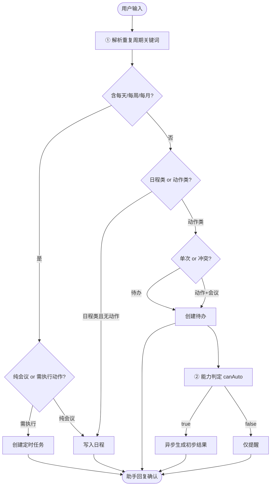

# 个人工作台 · 考题需求

> **SSOT**：个人工作台产品需求的**唯一来源**（`.md` 主本）。
>
> 可交互原型 `个人工作台.html` 为**衍生参考**，非权威；布局与字段以本文件为准。
>
> | 内容 | 权威来源 |
> |------|----------|
> | 产品需求原文 | 本文件 |
> | L4 功能点清单（编号、验收表与完成状态） | [个人工作台-功能点.md](./个人工作台-功能点.md) |
> | L4 → 技术模块/API 对照 | [个人工作台-技术功能点.md](./个人工作台-技术功能点.md) |
> | RAG 方案 | [待办知识库-RAG方案.md](./待办知识库-RAG方案.md) |
> | 未完成待办 Phase | [TODO/personal-workbench-enhancement.md](../../TODO/personal-workbench-enhancement.md) |

请基于本文档，实现一套 **个人 AI 助手工作台**（含可交互原型作为参考）。

---

## 一、题目说明

### 1.1 背景

实现面向企业员工的 **个人 AI 助手工作台**，在同一页面管理 **待办事项**、**日程安排** 与 **定时任务**，并通过右侧 **个人助手** 用自然语言创建内容、生成 AI 初步结果、多轮修改与历史回溯。

### 1.2 你需要交付

1. **工作台主页**：日程与事项双栏（待办 36% + 日程 64%）+ 右侧个人助手（340px）；
2. **待办管理**：列表、筛选、完成归档、逾期标记、手动添加；
3. **日程管理**：0–24 时时间轴、小月历、飞书/钉钉/Outlook/本地多渠道同步与去重；
4. **定时任务**：重复规则配置，到期 **物化待办**（非直接执行 AI）；
5. **自然语言分流**：先判定 **需执行才建待办**；会议/面试/出差等 **只写日程**；
6. **AI 初步结果**：待办层能力判定、结构化结果、预览、多轮修改、历史对话；
7. **配套能力**：统计胶囊联动、弹窗表单、Soul 设置入口（Demo 可 Toast）。

### 1.3 范围说明

- **需要实现**：上述页面布局、待办/日程/定时任务 CRUD（Demo 级）、NL 分流、日程去重、AI 结果展示与修改链路；
- **能力分层（必须遵守）**：定时任务 = 调度层 → 物化待办 = 工作单元 → 个人助手 AI = 待办层，**定时任务 Tab 不直接跑模型**；
- **自然语言核心原则**：仅 **需执行的动作** 形成待办；**会议、面试、出差、培训** 等日历占用类内容 **只写入日程**，不创建待办；
- **Demo 可接受**：数据存内存、刷新重置；外部日历 OAuth 可模拟；部分弹窗确定仅 Toast（见 §九）。
- **待办知识库（RAG，后续迭代）**：高价值且 **内部可闭环** 的方案见 [`待办知识库-RAG方案.md`](./待办知识库-RAG方案.md)（AI 生成/修订 ← SQLite 待办·日程·历史结果；不依赖飞书 MCP）。

---

## 二、工作台布局

| 项 | 要求 |
|---|---|
| 视口 | 全屏 `100vh`；主区与个人助手独立滚动 |
| 页签 | **日程与事项**（默认）、**定时任务** |
| 概览条 | 问候语 + 统计胶囊：日程 N 条 / 待办 N 项 / 逾期 N 项 / 已完成 N 项 |
| 双栏 | 左 **待办 36%**，右 **日程 64%**；≤1100px 上下堆叠 |
| 个人助手 | 右侧固定 340px；≤900px 移至主内容下方 |
| 导航 | 考核原型 **无** 左侧一级导航、**无** 顶栏面包屑 |

**布局示意**：

```
┌──────────────────────────────────────────────┬────────────┐
│  页签 + 概览条 + 待办 | 日程 双栏 / 定时任务列表  │  个人助手   │
└──────────────────────────────────────────────┴────────────┘
```

---

## 三、待办事项

### 3.1 工具栏

| 项 | 要求 |
|---|---|
| 筛选 | 进行中（默认）/ 全部待办 / 已完成 / 已逾期 |
| 添加 | **+ 添加事项** 弹窗 |

**筛选规则**：

| 筛选项 | 规则 |
|---|---|
| 进行中 | 仅未完成项；**隐藏**历史已完成区 |
| 全部待办 | 进行中 + 自动展开历史已完成 |
| 已完成 | 仅展示已完成区 |
| 已逾期 | 仅展示带 **已逾期** 标签的进行中项 |

### 3.2 卡片结构

| 元素 | 要求 |
|---|---|
| 完成态 | 左侧复选框；勾选后移入历史已完成区 |
| 标题 | 任务名；紧急项前缀 **!!紧急** |
| 描述 | 来源/能力说明/生成状态 |
| 截止时间 | `YYYY/MM/DD HH:mm` |
| 来源 | 如「来源：定时任务」「来源：自然语言」 |
| 逾期 | 红色 **已逾期** 标签 |
| AI 入口 | 紫色条：已生成结果 / 正在生成（disabled） |
| AI 面板 | 展开结构化预览 + 全屏查看 / 修改结果 / 确认 |
| 更多 | 编辑、取消待办、删除 |

### 3.3 历史已完成

- 折叠入口：**查看历史已完成** + 数量；
- 已完成样式：删除线、**已完成** 标签、**完成于** 时间戳；
- 操作：恢复为待办、删除。

### 3.4 示例数据（可自行 mock）

| 标题 | 说明 | 状态 |
|---|---|---|
| 做会议纪要 | 来源定时任务；含 AI 结果多版本 | 进行中 |
| 基金定投弱势群体 | 需人工；已逾期 | 进行中 |
| 基金选品 Agent-Mona | 模拟异步生成选品分析 | 进行中 |
| 完成UI改版方案 等 | 历史归档 | 已完成 |

---

## 四、我的日程

### 4.1 能力要求

| # | 能力 | 要求 |
|---|---|---|
| 1 | 时间轴 | 00:00–24:00；左刻度 + 右画布；块按起止时间纵向定位 |
| 2 | 当前时间线 | 橙色指示线（Demo 可固定 10:36） |
| 3 | 小月历 | 月视图、今日高亮、上/下月切换 |
| 4 | 多渠道 | 飞书、钉钉、Outlook、本地；可开关渠道 |
| 5 | 同步去重 | 标题相同 + 结束相同 + 开始差 ≤15min → 合并 1 条 |
| 6 | 来源标记 | 日程块 **右上角** 展示来源标签；合并项多标签 + 虚线边框 |
| 7 | 详情 | 点击块 → 弹窗展示全部来源 |
| 8 | NL 写入 | 个人助手识别为日程类 → 写入时间轴，来源 **本地** |

### 4.2 去重规则

- 原始数据可含跨渠道重复项；
- 同步条展示：**原始 N 条，去重后 M 条**；
- **不展示**「已去重」角标（仅用多来源标签表达）。

### 4.3 示例数据（可自行 mock）

| 时段 | 标题 | 来源 |
|---|---|---|
| 09:00 – 09:30 | 晨间站会 | 钉钉 + 飞书 |
| 10:30 – 11:30 | 产品需求评审 | 本地 |
| 13:30 – 14:00 | 客户方案演示 | Outlook |
| 14:00 – 15:00 | Q2 资源预算对齐 | Outlook + 飞书 |
| 16:00 – 17:00 | 交互设计走查 | 飞书 |
| 19:00 – 20:00 | 运营数据复盘 | 本地 |

---

## 五、定时任务

### 5.1 能力定位

定时任务 **不是 AI 执行层**，而是 **待办生成调度层**：

```text
定时任务（Cron）→ 到期物化待办 → 能力判定 → 个人助手初步结果（canAuto=true 时）
                                              └── canAuto=false 仅提醒
```

| 层级 | 职责 | 不负责 |
|---|---|---|
| 定时任务 | 重复周期、触发时间、待办标题 | 不直接调用大模型 |
| 待办 | 截止、来源、完成态；AI 唯一载体 | 不定义 Cron |
| 个人助手 | 待办创建/物化后能力判定与生成结果 | 不替代调度 |

**与日程的区别**：日程 = 日历时间块（会议/面试/出差）；定时任务 = 重复规则，产出 **待办**。

### 5.2 列表卡片

| 字段 | 要求 |
|---|---|
| 任务标题 | 物化待办默认标题 |
| 周期 | 如 每周四 17:00:00 |
| 待办生成说明 | 到期将生成怎样的待办（非 AI 执行描述） |
| 开关 | 启用/停用 |
| 菜单 | 编辑、**立即生成待办**（Demo）、删除 |

### 5.3 物化规则

| 周期 | 策略 |
|---|---|
| 每天 | 滚动维持未来 5 个自然日各 1 条待办 |
| 每周 | 每次仅生成下一次 1 条 |
| 每月 | 仅生成下一次计划日 1 条 |

物化后：`来源：定时任务` + 截止=触发时刻 → 走路能力与 AI 流程（同单次待办）。

### 5.4 新建任务弹窗

| 字段 | 要求 |
|---|---|
| 自然语言指令 | 解析周期与任务名 |
| 任务名称 | 必填 |
| 重复周期 | 每天 / 每周 / 每月 |
| 时间 | 时:分 |
| 待办生成说明 | 只读，自动生成 |
| 操作 | 取消、确定 |

---

## 六、个人助手与自然语言

### 6.1 侧栏结构

| 项 | 要求 |
|---|---|
| 标题 | **个人助手** |
| 工具 | 新建对话、历史对话、**Soul设置** |
| 欢迎语 | 说明会先区分 **待办** vs **日程** |
| 快捷 Chip | 见 §6.4 示例话术 |
| 输入 | 「向个人助手提问」+ 发送 |
| 修改模式 | 紫色顶栏：待办标题、版本、对话数；可退出 |

### 6.2 意图分流

个人助手收到自然语言后，**先判定是否需创建待办**：

| 判定 | 关键词示例 | 产出 |
|---|---|---|
| **日历占用 → 日程** | 会议、面试、出差、培训、演示、拜访、周会… | 写入时间轴，**不建待办** |
| **需执行 → 待办** | 完成、提交、整理、审核、复盘、回访… | 单次待办 + 能力判定 |
| **重复执行 → 定时任务** | 每天/每周/每月 + 动作（非纯会议） | Cron → 到期物化待办 |

**冲突优先级**：同时含「会议」与「整理/完成」→ **优先待办**（如「会后整理纪要」）。

**重复周期特殊规则**：

| 话术 | 产出 |
|---|---|
| 每周/每天 + 复盘、回访、整理… | 定时任务 |
| 每周/每天 + 纯周会/例会（无动作） | 日程 |

**助手回复须说明识别类型**，例如：

- 日程：「已识别为会议安排，无需创建待办。已写入日程…」
- 待办：「已识别为待执行事项，已添加待办…」

### 6.3 能力模型（仅待办层）

**不可自动**：电话、回访、线下、见面、签字、 → 仅提醒。

**可自动（关键词 → 结果类型）**：

| 关键词 | 类型 | 形态 |
|---|---|---|
| 会议纪要/纪要 | minutes | 进度 + 要点 + 结论 |
| 复盘 | review | 统计卡片 + 结论 |
| 审核 | audit | 合规清单 |
| 方案 | plan | 背景/步骤/风险 |
| 报告 | report | 摘要 + 要点 |
| 分析 | analysis | 指标表格 |
| 选品 | pick | 基金对比表 |

### 6.4 话术示例（考核参考）

| 用户输入 | 类型 | 预期 |
|---|---|---|
| 明天下午3点开项目评审会 | 日程 | 写时间轴，不建待办 |
| 下周二上午10点面试产品经理 | 日程 | 写时间轴 |
| 周三去北京出差 | 日程 | 写时间轴 |
| 本周五提醒我完成UI改造方案 | 待办 | 创建待办 + 截止 |
| 提醒我每天下午5点复盘港股收盘情况 | 定时任务 | 每天物化待办 |
| 提醒我每月15号下午5点回访客户 | 定时任务 | 每月物化；不可 auto |
| 提醒我下周三完成协议合规审核 | 待办 | audit 清单 |
| 会后整理会议纪要 | 待办 | 动作优先于会议词 |

**快捷 Chip 参考**：

- 明天下午3点开项目评审会
- 下周二上午10点面试产品经理
- 周三去北京出差
- 本周五提醒我完成UI改版方案
- 提醒我每天下午5点复盘港股收盘情况
- 提醒我下周三完成协议合规审核

---

## 七、AI 初步结果与对话回溯

### 7.1 生成与展示

| 事件 | 规则 |
|---|---|
| 触发 | 待办创建 / 定时任务物化 / 手动添加后能力判定 |
| canAuto=true | 异步生成；待办下方紫色入口条 + 可展开面板 |
| canAuto=false | 描述「需人工处理」，无 AI 条 |
| 全屏预览 | 弹窗展示完整 HTML 结果 |
| 确认 | 用户点击 **确认结果** 或全屏弹窗 **确定** → 待办 **自动标记完成** 并移入历史已完成区 |

### 7.2 多轮修改

| 步骤 | 规则 |
|---|---|
| 入口 | 面板/弹窗 **修改结果** |
| 模式 | 个人助手进入修改模式；隐藏欢迎语与 Chip |
| 输入 | 用户描述修改意见 → 更新结果 HTML、递增版本号 |
| 快照 | 每次修订写入对话线程（含 ai-result 消息） |
| 退出 | 恢复普通助手界面 |

**Demo 支持的修改关键词**：进度/百分比、补充/添加、精简、结论、删除段落、表格/选品。

### 7.3 历史对话

- 顶栏 **🕐** → 左右分栏弹窗：左列表（待办、版本、条数）+ 右结果预览；
- **继续修改 / 进入对话** → 关闭弹窗并进入修改模式，渲染完整线程；
- Demo 待办「做会议纪要」预置：v1 纪要 → 用户修改 → v2 纪要。

---

## 八、处理流程

用户通过个人助手输入自然语言时，按以下流程处理：



**你需要实现的关键节点**：

1. **意图分流**：待办 / 日程 / 定时任务三分；
2. **日程去重**：多渠道合并 + 来源标签；
3. **物化链路**：定时任务 → 待办 → 能力判定 → AI（非 Cron 直跑）；
4. **结果修订**：版本递增 + 线程快照；
5. **统计联动**：待办数、日程数、逾期、已完成随操作刷新。

---

## 九、交互规则

### 9.1 弹窗与表单

| 场景 | 要求 |
|---|---|
| 添加事项确定 | 新增待办至列表；命中能力词则触发 AI |
| 添加日程确定 | Demo 可 Toast；NL 日程类须写时间轴 |
| 新建定时任务确定 | Demo 可 Toast；须能演示物化链路 |
| 编辑保存 | Demo 可 Toast |
| Soul设置 / 附件 | Demo Toast 即可 |

### 9.2 异常与边界

| 场景 | 处理方式 |
|---|---|
| 会议/面试/出差类输入 | 只写日程，明确告知不建待办 |
| 需人工待办 | 卡片说明原因，不生成 AI 结果 |
| AI 生成中 | 入口条 disabled，完成后替换为可点击 |
| 确认 AI 结果 | 待办自动完成；描述更新为「个人助手结果已确认」 |
| 渠道全部关闭 | 时间轴为空；统计仍展示原始/去重条数 |
| 刷新页面 | Demo 数据重置为种子态 |

### 9.3 非功能

| 类别 | 要求 |
|---|---|
| 布局 | 全屏；双栏 + 侧栏独立滚动 |
| 终端 | Web 桌面为主；1100 / 900 / 640 断点适配 |
| 持久化 | 正式版落库；Demo 内存即可 |

---

*— 文档结束 —*
