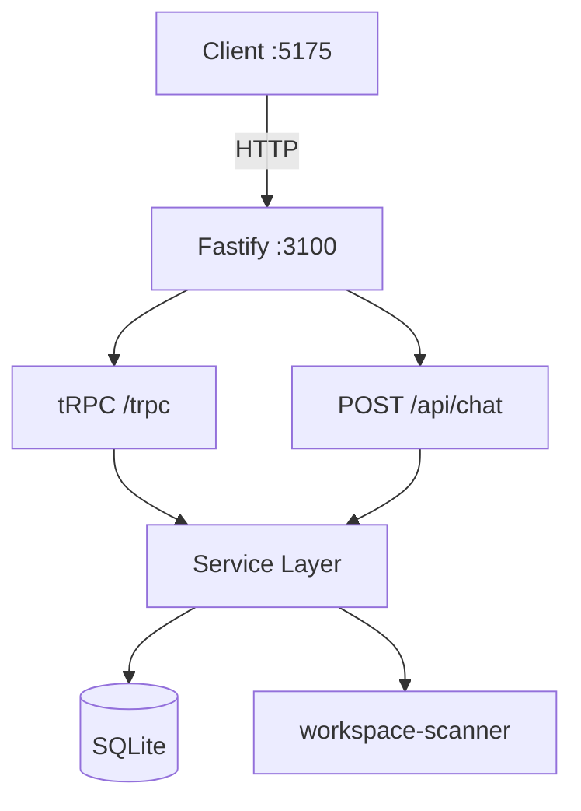
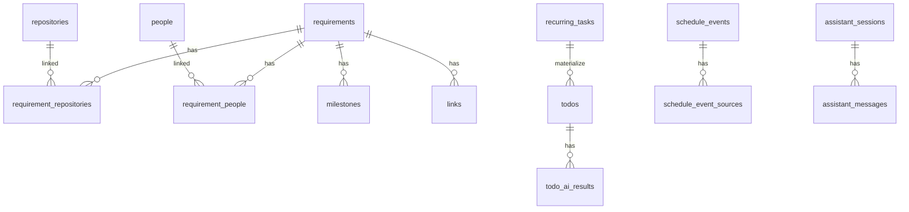

# Server ARCHITECTURE.md

> **读者优先级：AI Agent > 人类开发者**
>
> 后端架构**引用层**。操作指南见 `AGENTS.md`；全栈视图见 `../ARCHITECTURE.md`。SSOT 映射见 [../AGENTS.md §2](../AGENTS.md#2-文档映射ssot)。

---

## 1. 在系统中的位置



| 属性 | 值 |
|------|-----|
| 包名 | `@project-manager/server` |
| 运行时 | Node.js ESM |
| HTTP | Fastify 5 + `@fastify/cors` |
| API | tRPC 11 + Zod 3 |
| 持久化 | better-sqlite3 → `data/project-manager.db` |
| Git | simple-git |

---

## 2. 启动序列

**入口**：`src/index.ts` → `main()`

1. `getDb()` — 执行 `SCHEMA_SQL` + `seedDatabase()`
2. `Fastify({ logger: true })`
3. 注册 CORS（`origin: true`）
4. `fastifyTRPCPlugin` — prefix `/trpc`，router: `appRouter`，context: `createContext`
5. `registerChatRoutes` — `POST /api/chat`
6. `GET /health` → `{ ok: true }`
7. `listen({ port: PORT ?? 3100, host: '0.0.0.0' })`

---

## 3. 分层架构

```
┌─────────────────────────────────────────┐
│  Transport                              │
│  index.ts | routes/chat.ts              │
│  trpc/router.ts (Zod + 薄路由)           │
├─────────────────────────────────────────┤
│  Service                                │
│  requirement / repository / people      │
│  association / graph / assistant        │
├─────────────────────────────────────────┤
│  Infrastructure                         │
│  db/ (schema, seed, getDb)              │
│  scanner/workspace-scanner              │
└─────────────────────────────────────────┘
```

**Router 原则**：无 SQL；关联 mutation 后 `touchRequirement(requirementId)`。

**TrpcContext**（`trpc/context.ts`）：当前为空对象，预留扩展。

---

## 4. 请求链路

### 4.1 tRPC

```
POST /trpc/namespace.procedure
  → fastifyTRPCPlugin
  → appRouter procedure
  → *-service.ts
  → better-sqlite3
```

Zod 校验在 router；返回形状对齐 `@project-manager/shared` 类型。

### 4.2 对话 SSE

```
POST /api/chat  { message?: string, context?: 'dev' | 'personal', modifyTodoId?, sessionId? }
  → routes/chat.ts
  → assistant-service.resolveAssistantIntent() / personal-assistant-service.resolvePersonalAssistantIntent()
  → SSE:
       { type: 'text', content: string }
       { type: 'action', action: NavigationAction }          # dev 助手
       { type: 'refresh', refresh: PersonalAssistantRefresh[] } # personal 助手
       { type: 'modifyMode', modifyTodoId, modifyVersion }   # personal 修改模式
       { type: 'done' }
```

按句号分块输出，块间 delay ~120ms。

---

## 5. 数据模型

### 5.1 ER 关系



### 5.2 表清单

| 表 | 用途 |
|----|------|
| `settings` | KV（`workspace_path` 等） |
| `repositories` | Git 仓库资产快照 |
| `people` | 人员主数据 |
| `requirements` | 需求主体 |
| `requirement_repositories` | 需求↔仓库 M:N |
| `requirement_people` | 需求↔人员 M:N |
| `milestones` | 里程碑 |
| `links` | 外部链接 URL |
| `repository_branch_notes` | 分支备注 |
| `scan_snapshots` | 扫描历史 JSON |
| `requirement_status_history` | 需求状态变更历史 |
| `todos` | 待办主体 |
| `todo_ai_results` | 待办 AI 结果版本 |
| `schedule_events` + `schedule_event_sources` | 日程去重结果与来源明细 |
| `calendar_sources` | 日历来源开关 |
| `recurring_tasks` + `recurring_task_runs` | 定时任务与物化记录 |
| `assistant_sessions` + `assistant_messages` | 个人助手会话与消息 |

**Schema**：`src/db/schema.ts`（`SCHEMA_SQL` 常量）

**初始化**：`src/db/index.ts` → `getDb()`

**Migration**：❌ 未实现

**Pragma**：`journal_mode=WAL`，`foreign_keys=ON`

### 5.3 命名映射

| SQLite | TypeScript |
|--------|------------|
| snake_case | camelCase（service `mapXxx`） |
| `is_dirty` INTEGER | boolean |
| `tech_tags`, `env_scripts`, `payload` TEXT | JSON.parse |

**类型源**：`../shared/src/types.ts`（见 `../shared/ARCHITECTURE.md`）

### 5.4 核心枚举

```
RequirementStatus, Priority, CollaborationDirection, ManagementRole
PersonCollaborationStatus, MilestoneStatus
GraphNodeType, NavigationActionType
TodoSource, TodoStatus, TodoAiStatus, AiResultType, CalendarSourceType, RecurringFrequency
```

---

## 6. API 契约

### 6.1 tRPC Router 树

```
appRouter
├── settings      get/setWorkspacePath, get/setIgnoreDirs
├── workbench     summary
├── personalWorkbench summary
├── weeklyReport  generate
├── requirements  list, detail, create, update, delete,
│                 add/remove Repository/Person/Milestone/Link, updateMilestone
├── graph         get({ requirementId? })
├── repositories  list/detail/requirements/branches/setBranchNote
│                 deleteBranch/syncBranches/scanWorkspace/latestScan/openInCursor
├── people        list/create/update/delete
├── todos         list/detail/create/update/complete/restore/cancel/delete
│                 aiResults/confirmAiResult/reviseAiResult
├── schedule      listDay/detail/createLocal/delete/sources/setSourceEnabled
├── recurringTasks list/create/update/toggle/delete/materializeNow
└── assistant     sessions/messages/createSession/appendMessage/resolveIntent
```

实现与 Zod：`src/trpc/router.ts`

### 6.2 REST

| Method | Path | Response |
|--------|------|----------|
| GET | `/health` | `{ ok: true }` |
| POST | `/api/chat` | SSE stream |

---

## 7. Service 详述

| Service | 职责 |
|---------|------|
| `requirement-service` | 需求 CRUD；`getRequirementDetail` JOIN 关联；`getWorkbenchSummary` 聚合 |
| `repository-service` | 仓库 live 列表、分支查询/同步/删除、分支备注、扫描 UPSERT + 快照 |
| `cursor-service` | 仓库按分支切换并在 Cursor 中打开（Agent/Classic） |
| `people-service` | 人员 CRUD |
| `association-service` | 关联边 CRUD；`getRepositoryRequirements` 反查；`touchRequirement` |
| `graph-service` | `getRequirementGraph` 构建 nodes/edges |
| `weekly-report-service` | 周报区间聚合与 Markdown 输出（含飞书链接优先） |
| `todo-service` | 待办 CRUD、AI 状态流转、个人工作台统计 |
| `ai-result-service` | 能力判定、模板结果生成、版本修订 |
| `schedule-service` | 日程去重、来源开关、详情查询、本地日程写入 |
| `recurring-task-service` | 定时任务 CRUD、滚动物化待办 |
| `assistant-session-service` | 助手会话与消息持久化 |
| `assistant-service` | 开发域助手：规则匹配 → reply + NavigationAction |
| `personal-assistant-service` | 个人助手：待办/日程/定时任务意图解析 + refresh 返回 |

---

## 8. Git 扫描子系统

**链路**：`repositories.scanWorkspace` → `repository-service.runWorkspaceScan()` → `scanner/workspace-scanner.ts`

**算法**：

1. `workspacePath` = input 或 `settings.workspace_path`
2. 遍历 workspace **一级子目录**
3. 含 `.git` → `scanRepository()`
4. `simple-git`：remote, branch, status, last commit
5. 读 `package.json` → `detectTechTags()` / `detectEnvScripts()`
6. UPSERT `repositories`；append `scan_snapshots`

**容错**：单仓失败不中断

**标签检测**（非穷尽）：Vue2/3, Vite, React, TypeScript, Vant, Element UI, View Design, ECharts, Sentry

---

## 9. 关系图谱子系统

**入口**：`graph.get` → `graph-service.getRequirementGraph(requirementId?)`

| 模式 | 行为 |
|------|------|
| 有 `requirementId` | 以该需求为中心的局部图 |
| 无 | 全量总览图 |

**节点类型**：requirement, repository, person, milestone

Client 侧 ReactFlow 只读渲染；server 只提供 JSON 图数据。

---

## 10. 对话与个人助手子系统

**实现**：规则引擎（非 LLM）

| 助手 | 输入上下文 | 主要输出 |
|------|----------|----------|
| `assistant-service` | `context=dev` | `reply` + `NavigationAction` |
| `personal-assistant-service` | `context=personal` | `reply` + `refresh` + 可选 `modifyMode` |

**开发域动作**：`openWorkbench/openScanCenter/openGraph/openRequirementDetail/filterRequirements`

**个人域动作**：自动创建待办/日程/定时任务；修改模式下修订 AI 结果并返回刷新目标

**未实现**：LLM 推理链、外部知识库接入、复杂多轮规划

---

## 11. 构建与配置

| 配置项 | 位置 | 默认 |
|--------|------|------|
| 端口 | `process.env.PORT` | 3100 |
| 数据库 | `data/project-manager.db` | gitignore |
| workspace 路径 | `settings.workspace_path` | seed: `/Users/ningliu/Documents/CodeLab` |

**构建**：`tsc` → `dist/`；启动 `node dist/index.js`

**无** `.env`、ESLint、Vitest

---

## 12. 实现状态

**唯一对照来源**：[../IMPLEMENTATION_STATUS.md](../IMPLEMENTATION_STATUS.md)。不在本文件维护缺口表。

---

## 13. 关键文件索引

```
src/index.ts
src/trpc/router.ts
src/trpc/context.ts
src/routes/chat.ts
src/db/schema.ts
src/db/seed.ts
src/db/index.ts
src/scanner/workspace-scanner.ts
src/services/requirement-service.ts
src/services/repository-service.ts
src/services/people-service.ts
src/services/association-service.ts
src/services/graph-service.ts
src/services/weekly-report-service.ts
src/services/todo-service.ts
src/services/ai-result-service.ts
src/services/schedule-service.ts
src/services/recurring-task-service.ts
src/services/assistant-session-service.ts
src/services/assistant-service.ts
src/services/personal-assistant-service.ts
src/services/cursor-service.ts
src/services/feishu-service.ts
```
