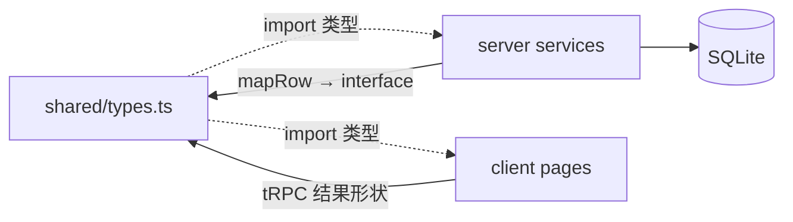
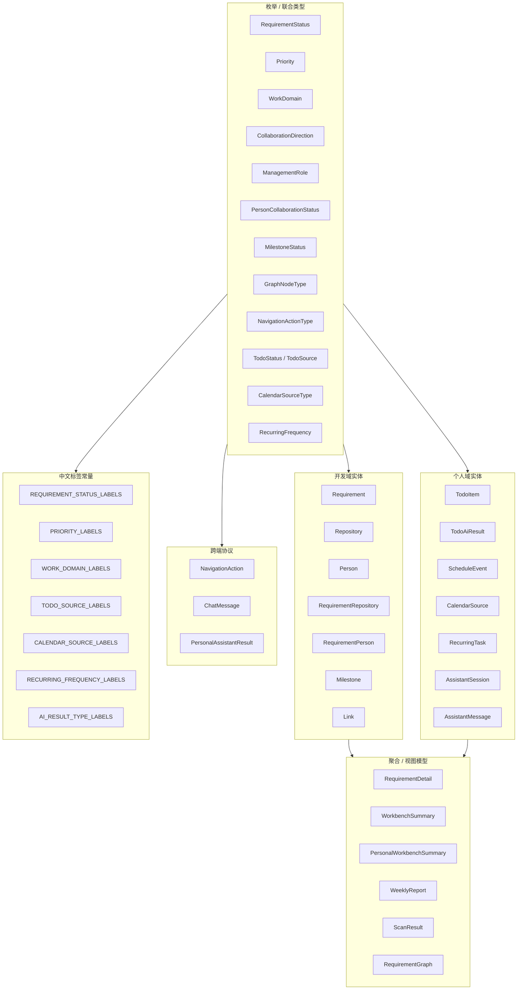

# Shared ARCHITECTURE.md

> **读者优先级：AI Agent > 人类开发者**
>
> 共享类型包架构**定义层**（类型体系展开说明）。操作指南见 `AGENTS.md`；全栈视图见 `../ARCHITECTURE.md`。SSOT 映射见 [../AGENTS.md §2](../AGENTS.md#2-文档映射ssot)。

---

## 1. 在系统中的位置



| 属性 | 值 |
|------|-----|
| 包名 | `@project-manager/shared` |
| 运行时 | 无独立进程；编译为 ESM + `.d.ts` |
| 依赖 | 仅 `typescript`（dev） |
| 入口 | `dist/index.js` / `dist/index.d.ts` |

**设计原则**：shared 定义「是什么」；server 定义「怎么存、怎么算」；client 定义「怎么展示」。AppRouter **不在** shared 中。

---

## 2. 模块结构

```
src/
├── index.ts               统一导出入口
├── types.ts               领域模型 / 协议 / 标签常量
├── work-model.ts          工作域模块抽象
├── feishu.ts              飞书 open_id 与 deep link helper
└── report-week-range.ts   周报默认周期 helper
```

其中 `types.ts` 仍是核心单一类型源；其余文件提供跨端复用的轻量纯函数。

---

## 3. 类型分层



---

## 4. 枚举与标签

### 4.1 带中文标签的枚举

| 类型 | 值 | 标签常量 |
|------|-----|----------|
| `RequirementStatus` | pending_review … paused（7 个） | `REQUIREMENT_STATUS_LABELS` |
| `Priority` | high, medium, low | `PRIORITY_LABELS` |
| `WorkDomain` | dev/life/learning/admin/other | `WORK_DOMAIN_LABELS` |
| `TodoSource` | manual/natural_language/recurring_task | `TODO_SOURCE_LABELS` |
| `CalendarSourceType` | feishu/dingtalk/outlook/local | `CALENDAR_SOURCE_LABELS` |
| `RecurringFrequency` | daily/weekly/monthly | `RECURRING_FREQUENCY_LABELS` |
| `AiResultType` | minutes/review/audit/plan/report/analysis/pick | `AI_RESULT_TYPE_LABELS` |

**模式**：`Record<EnumType, string>` 与联合类型同文件，新增 enum 成员必须补标签键。

### 4.2 无 shared 标签的枚举

以下 enum 在 client 通过 `utils/labels.ts` 或页面内映射展示：

| 类型 | 用途 |
|------|------|
| `CollaborationDirection` | upstream / downstream |
| `ManagementRole` | owner, participant, watcher, acceptor, release_coordinator |
| `PersonCollaborationStatus` | 人员协作状态 |
| `MilestoneStatus` | 里程碑状态 |
| `GraphNodeType` | 图谱节点类型 |
| `NavigationActionType` | 开发域助手导航动作 |
| `TodoStatus` / `TodoAiStatus` | 待办生命周期与 AI 状态 |
| `TodoFilter` | 待办筛选 |
| `AiResultStatus` | AI 结果版本状态 |
| `PersonalAssistantRefresh` | 个人助手 refresh 指令集合 |

---

## 5. 实体模型

### 5.1 开发域核心实体

| Interface | 说明 | 主键 |
|-----------|------|------|
| `Requirement` | 需求主体 | id |
| `Repository` | Git 仓库资产 | id |
| `Person` | 人员主数据 | id |

### 5.2 开发域关联实体

| Interface | 关系 |
|-----------|------|
| `RequirementRepository` | Requirement ↔ Repository M:N 属性 |
| `RequirementPerson` | Requirement ↔ Person M:N 属性 |
| `Milestone` | Requirement 1:N |
| `Link` | Requirement 1:N 外部链接 |

### 5.3 个人工作台实体

| Interface | 说明 |
|-----------|------|
| `TodoItem` | 待办主体（含 AI 状态、逾期计算字段） |
| `TodoAiResult` | 待办 AI 结果版本 |
| `ScheduleEvent` / `ScheduleEventSource` | 去重后日程与来源明细 |
| `CalendarSource` | 日历来源开关 |
| `RecurringTask` | 定时任务配置 |
| `AssistantSession` / `AssistantMessage` | 个人助手会话消息 |

### 5.4 聚合类型

| Interface | 组成 |
|-----------|------|
| `RequirementDetail` | Requirement + repositories[]（含嵌套 Repository）+ people[]（含嵌套 Person）+ milestones[] + links[] |
| `WorkbenchSummary` | 四个 Requirement[] 分区 + 计数统计 |
| `PersonalWorkbenchSummary` | 今日日程/待办/逾期/完成统计 |
| `WeeklyReport` | 周报正文 + 分组 section + 风险行 |
| `ScanResult` | scannedAt + repositoryCount + Repository[] |
| `RequirementGraph` | requirementId? + GraphNode[] + GraphEdge[] |

---

## 6. 与 SQLite 字段对照

shared 使用 **camelCase**；server service 层从 snake_case 映射。

| Interface 字段 | SQLite 列（典型） |
|----------------|-------------------|
| `targetVersion` | `target_version` |
| `plannedReleaseAt` | `planned_release_at` |
| `defaultBranch` | `default_branch` |
| `isDirty` | `is_dirty` (0/1) |
| `techTags` | `tech_tags` (JSON text) |
| `requirementId` | `requirement_id` |
| `managementRole` | `management_role` |
| `roleType` | `role_type` |

**不在 shared 建模**：`settings` KV、`scan_snapshots` 内部 payload 结构（ScanResult 为 API 层 DTO）。

完整表结构见 `../server/ARCHITECTURE.md § 数据模型`。

---

## 7. 图谱、助手与通用 helper 协议

### 7.1 关系图谱

```typescript
GraphNode   { id, type: GraphNodeType, label, meta? }
GraphEdge   { id, source, target, label }
RequirementGraph { requirementId: number | null, nodes, edges }
```

- `id` 为 string（server 生成，如 `req-1`, `repo-3`）
- `meta` 可选键值，供 GraphPage  Tooltip 等

### 7.2 对话助手

```typescript
NavigationAction { type: NavigationActionType, payload?: Record<string, string | number | boolean> }
ChatMessage      { role: 'user' | 'assistant', content, action? }
PersonalAssistantResult { reply, refresh?, modifyTodoId?, modifyVersion? }
```

**payload 约定**（非 TS 强制，跨端事实标准）：

| action.type | payload 键 |
|-------------|------------|
| `openRequirementDetail` | `requirementId: number` |
| `openGraph` | `requirementId?: number` |
| `filterRequirements` | `riskOnly?: boolean`, `keyword?: string` |
| `openWorkbench` / `openScanCenter` | 通常无 payload |

### 7.3 通用 helper

| 文件 | 能力 |
|------|------|
| `work-model.ts` | `WORK_DOMAIN_MODULES`, `isDevWorkDomain`, `getWorkDomainModule` |
| `feishu.ts` | `resolveFeishuOpenId`, `getFeishuChatDeepLink` |
| `report-week-range.ts` | `getReportWeekRange`（周报默认周期） |

---

## 8. 构建与发布

**package.json exports**：

```json
".": {
  "types": "./dist/index.d.ts",
  "import": "./dist/index.js"
}
```

**tsconfig**：`declaration: true`，`outDir: dist`，`moduleResolution: bundler`

**脚本**：

| 命令 | 作用 |
|------|------|
| `pnpm build` | `tsc` → `dist/` |
| `pnpm dev` | `tsc --watch` |

Monorepo 根 `pnpm build` 顺序：**shared → server → client**。

---

## 9. 刻意不在 shared 的内容

| 内容 | 所在位置 | 原因 |
|------|----------|------|
| `AppRouter` | `server/src/trpc/router.ts` | tRPC 路由与 shared 领域解耦 |
| Zod schema | server router | 运行时校验属 server |
| DB row 类型 | server service 内部 | 避免泄漏持久化细节 |
| UI 专用 props | client components | 展示层类型 |
| `projects` / `apps` 模型 | 未实现 | 见 PLATFORM_PLAN |

---

## 10. 实现状态

**唯一对照来源**：[../IMPLEMENTATION_STATUS.md](../IMPLEMENTATION_STATUS.md)。类型定义权威来源仍为 `shared/src/types.ts`；不在本文件维护规划缺口表。

扩展新实体时：先在 `types.ts` 定义 interface + enum，再向下游 server/client 同步。

---

## 11. 关键文件索引

```
src/types.ts      领域模型、协议、标签常量（主文件）
src/work-model.ts 工作域抽象与能力开关
src/feishu.ts     飞书 open_id / deep link helper
src/report-week-range.ts 周报周期 helper
src/index.ts      导出入口
package.json      exports 与 workspace 包名
tsconfig.json     编译选项
dist/index.d.ts   消费方类型解析目标
```
